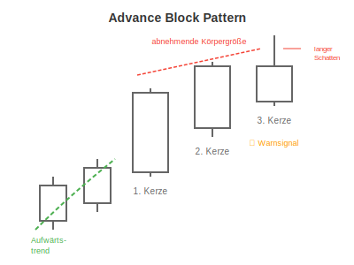

# Advance Block Pattern

## Kurzbeschreibung

Das Advance Block Pattern besteht aus drei aufeinanderfolgenden weißen Kerzen, deren Höhe von links nach rechts abnimmt.

## Art der Formation

**Bearische Umkehrformation**

## Aufbau der Formation

Wie schon das zuvor beschriebene Three White Soldiers Pattern besteht auch diese Kerzenformation aus drei aufeinanderfolgenden weißen Kerzen. Im Gegensatz zum Three White Soldiers Pattern folgen die drei weißen Kerzen beim Advance Block Pattern aber nicht auf eine Abwärtsbewegung, sondern auf einen Aufwärtstrend.

Ein weiterer Unterschied zur White Soldiers Formation ist, dass die Kerzen beim Advance Block Pattern unterschiedlich groß sind.

Die erste Kerze der Formation ist die größte Kerze und hat einen langen Körper ohne längere obere und untere Schatten.

Es folgt eine etwas kleinere Kerze, deren Eröffnungskurs innerhalb des Kerzenkörpers der ersten Kerze liegt. Im Laufe des Tages steigt der Kurs der zweiten Kerze aber und schließt dadurch oberhalb des Schlusskurses der ersten Kerze.

Die letzte Kerze hat einen noch kleineren Kerzenkörper als ihre beiden Vorkerzen und einen langen oberen Schatten. Auch diese Kerze eröffnet innerhalb des Körpers ihrer Vorkerze.

## Bedeutung

Die Formation zeigt ein Abschwächen der Aufwärtsbewegung an. Während die erste Kerze noch auf einen starken Kursanstieg hinweist, schwächt sich der Aufwärtstrend im weiteren Verlauf der Formation immer weiter ab.

Schon bei der zweiten Kerze deutet der kleinere Kerzenkörper an, dass der Aufwärtsdruck etwas nachlässt.

Bei der dritten Kerze kommt die Aufwärtsbewegung dann mehr oder weniger ganz zum Erliegen. Der lange obere Schatten der letzten Kerze deutet an, dass sich der Kurs zwar im Handelsverlauf nach oben bewegt hat, er sich aber auf diesem Kursniveau nicht halten konnte und schließlich deutlich tiefer schließen musste. All dies weist darauf hin, dass es dem Kurs in den letzten beiden Tagen schwerer gefallen ist, weiter nach oben zu steigen.

## Trading

Die Advance Block Formation ist als erstes Warnsignal zu verstehen, das ein mögliches Ende der Aufwärtsbewegung und eine Trendumkehr ankündigt.

Für einen Einstieg auf der Shortseite ist es aber noch zu früh. Erst wenn sich in den kommenden Tagen die Vorzeichen für wieder fallende Kurse mehren, kann auf einen Kursrückgang spekuliert werden.

### Falscher Alarm

Bewegt sich der Kurs hingegen über den oberen Schatten der letzten Kerze, hat sich die Formation als falscher Alarm entpuppt und es ist eher mit weiter steigenden Kursen zu rechnen.

---

## Zusammenfassung

| Eigenschaft | Beschreibung |
|-------------|--------------|
| **Pattern-Typ** | Bearische Umkehrformation |
| **Anzahl Kerzen** | 3 (weiße Kerzen mit abnehmender Größe) |
| **Vorheriger Trend** | Aufwärtsbewegung |
| **Signal** | Warnsignal für mögliche Trendumkehr |
| **Einstieg** | Abwarten auf Bestätigung |
| **Invalidierung** | Kurs über oberem Schatten der 3. Kerze |
| **Stärke** | Frühes Warnsignal (moderate Stärke) |
