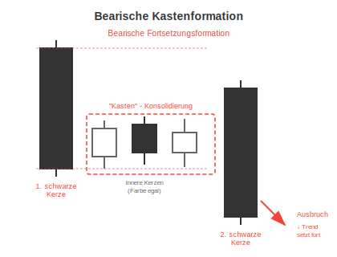

# Bearische Kastenformation

## Kurzbeschreibung

Bei der bearischen Kastenformation bilden die beiden schwarzen äußeren Kerzen einen Kasten, in dem die inneren Kerzen eingeschlossen sind.

## Art der Formation

**Bearische Fortsetzungsformation**

## Aufbau der Formation

Die bearische Kastenformation folgt immer auf eine Abwärtsbewegung. Vor der Formation haben sich die Kurse also nach unten bewegt. Im Idealfall liegen vor dem Kasten mehrere aufeinanderfolgende schwarze Kerzen.

Die erste Kerze der Formation hat einen langen schwarzen Kerzenkörper und ist selbst noch Bestandteil der vorherigen Abwärtsbewegung.

Auf die schwarze Kerze folgen eine Reihe von kleineren Kerzen, deren Körper sich alle innerhalb des Körpers der ersten schwarzen Kerze befinden. Wie schon bei der bullischen Variante der Formation sind auch hier die Anzahl der Kerzen und die Farben der Kerzenkörper unwichtig.

Den Abschluss bildet eine zweite schwarze Kerze, deren Kerzenkörper die Körper der inneren Kerzen vollständig umklammert. Die Körper der inneren Kerzen müssen sich also vollkommen innerhalb des Körpers der letzten Kerze befinden.

Im Gegensatz zur ersten schwarzen Kerze schließt die letzte Kerze aber deutlich tiefer. Der Schlusskurs der langen schwarzen Kerze liegt unter den unteren Schatten aller vorherigen Kerzen, sodass der Körper der letzten Kerze nach unten aus der Formation herausragt.

## Bedeutung

Die bearische Kastenformation stellt eine kurze Unterbrechung des bestehenden Abwärtstrends dar. Die Kerzen im Inneren der Formation bewegen sich in einer engen Range und zeigen dadurch einen unentschlossenen Markt an.

Dann aber fällt der Kurs mit der letzten Kerze wieder aus dieser Range heraus und einer weiteren Abwärtsbewegung steht nichts mehr im Wege.

## Trading

Taucht eine bearische Kastenformation im Chart auf, muss von weiter fallenden Kursen ausgegangen werden. Um an diesem Kurseinbruch partizipieren zu können, kann eine Short Position eröffnet werden. Der Einstieg in diese Short Position erfolgt entweder am Tag der zweiten schwarzen Kerze oder am Folgetag, falls sich der Kurs unter den unteren Schatten der letzten Kerze bewegt.

---

## Zusammenfassung

| Eigenschaft | Beschreibung |
|-------------|--------------|
| **Pattern-Typ** | Bearische Fortsetzungsformation |
| **Anzahl Kerzen** | Variabel (mind. 3) |
| **Vorheriger Trend** | Abwärtsbewegung |
| **Signal** | Fortsetzung des Abwärtstrends |
| **Schlüsselmerkmal** | Kleine Kerzen zwischen zwei großen schwarzen |
| **Einstieg** | Tag der 2. schwarzen Kerze oder unter unterem Schatten |
| **Stärke** | Stärker bei längerer Konsolidierung |
| **Besonderheit** | Keine klassische Formation, aber häufig |

## Vergleich: Bullische vs. Bearische Kastenformation

| Merkmal | Bullische Kastenformation | Bearische Kastenformation |
|---------|--------------------------|--------------------------|
| **Trend** | Aufwärtstrend | Abwärtstrend |
| **Äußere Kerzen** | 2 weiße (bullisch) | 2 schwarze (bearisch) |
| **Innere Kerzen** | Beliebige Farbe | Beliebige Farbe |
| **Ausbruchsrichtung** | Nach oben | Nach unten |
| **Signal** | Bullische Fortsetzung | Bearische Fortsetzung |
| **Position** | Long | Short |
| **Einstieg** | Über oberem Schatten | Unter unterem Schatten |
