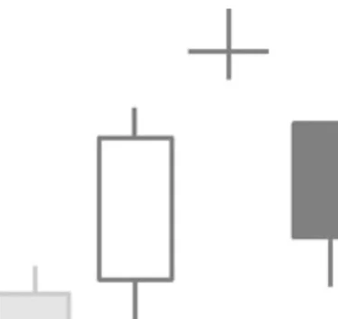

# Bearish Abandoned Baby Pattern

## Kurzbeschreibung

Beim Bearish Abandoned Baby Pattern schwebt eine Doji Kerze sowohl über der vorherigen als auch über der nachfolgenden Kerze.

## Art der Formation

Bearische Umkehrformation

## Aufbau der Formation

Das Bearish Abandoned Baby Pattern folgt immer auf eine Aufwärtsbewegung.

Die erste Kerze des Patterns ist eine weiße Kerze mit einem langen Kerzenkörper.

Als Zweites folgt ein Doji. Bei der zweiten Kerze entspricht also der Eröffnungskurs dem Schlusskurs, sodass anstatt eines farbigen Kerzenkörpers eine waagerechte Linie eingezeichnet wird.

Zwischen der ersten und der zweiten Kerze befindet sich ein Gap. Der tiefste Punkt der zweiten Kerze liegt also oberhalb des höchsten Kurses der ersten Kerze.

Auch die folgende Kerze eröffnet mit einer Kurslücke. Allerdings kommt es diesmal zu einem Abwärtsgap. Beide Gaps befinden sich damit unterhalb der Doji Kerze, die über der vorherigen und der nachfolgenden Kerze zu schweben scheint.

Die Kerze nach dem zweiten Gap ist eine schwarze Kerze mit langem Kerzenkörper.

## Bedeutung

Das Pattern ähnelt stark dem schon zuvor vorgestellten Evening Doji Star. Allerdings dürfen sich beim Abandoned Baby Pattern die Schatten der einzelnen Kerzen nicht berühren. Die Kurslücken beim Abandoned Baby Pattern sind also größer als beim Evening Doji Star.

Im Vergleich zum Evening Doji Star findet sich dieses Pattern daher deutlich seltener im Chart. Ansonsten signalisieren die beiden Candlestick Patterns aber mehr oder weniger dasselbe. Im Verlauf des Patterns kommt es zu einem Trendwechsel, bei dem der Kurs von einem Aufwärtstrend zu einer Abwärtsbewegung übergeht.

Beim Bearish Abandoned Baby Pattern erfolgt dieser Trendwechsel etwas stärker und ausgeprägter, sodass dieses Pattern das etwas stärkere Abwärtssignal ist.

## Trading

Nach dem Pattern ist mit fallenden Kursen zu rechnen.

Ein Einstieg in eine Short Position erfolgt entweder am Ende der dritten Kerze oder am Folgetag, sobald sich der Kurs tiefer bewegt.
