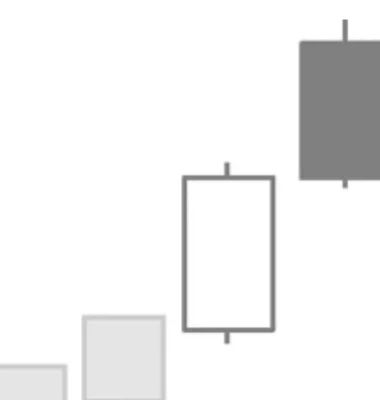

# Bearish Counterattack Pattern

## Kurzbeschreibung

Bei einem Bearish Counterattack Pattern schließt eine lange schwarze Kerze zum selben Schlusskurs wie ihre weiße Vorkerze.

## Art der Formation

Bearische Umkehrformation

## Aufbau der Formation

Vor der Formation befand sich der Kurs in einer Aufwärtsbewegung.

Die erste Kerze des Bearish Counterattack Patterns ist eine weiße Kerze mit langem Kerzenkörper.

Am Folgetag springt der Kurs gleich zur Handelseröffnung nach oben und eröffnet mit einer deutlichen Aufwärtskurslücke. Der Eröffnungskurs liegt also deutlich über dem Höchstkurs der vorherigen Kerze.

Nach der sprunghaften Eröffnung beginnen die Kurse aber wieder zu fallen, sodass der Kurs am Tagesende genau auf Höhe des vorherigen Schlusskurses aus dem Handel geht. Die untere waagerechte Linie des schwarzen Kerzenkörpers liegt dadurch exakt auf der gleichen Höhe wie die obere Linie des vorherigen weißen Kerzenkörpers.

## Bedeutung

Wie schon die bullische Variante zeigt auch das Bearish Counterattack Pattern an, dass einige Anleger auf dem falschen Fuß erwischt wurden.

Am zweiten Tag der Formation wurden schon vor der Börseneröffnung eine ganze Reihe von Kauforders aufgegeben, sodass es gleich bei der Eröffnung zu einer starken Kurslücke nach oben gekommen ist.

Dann aber begannen die Kurse zu fallen und die Anleger, die gleich zur Handelseröffnung eingestiegen waren, sahen sich plötzlich mit Verlusten konfrontiert.

Nachdem die ersten Anleger ihre Verlustpositionen geschlossen hatten, setzte der Kurs seine Abwärtsbewegung weiter fort, sodass der Kurs am Tagesende seine ganzen Gewinne wieder abgegeben hatte.

Zu großen Kurslücken kommt es häufig, wenn Unternehmen vor Börseneröffnung positive Unternehmenszahlen veröffentlichen. Die Aktie springt dann nach diesen Meldungen zunächst einmal nach oben, fällt danach aber wieder zurück, weil keine weiteren Anschlusskäufe erfolgen.

Ein solcher Kursrückgang ist als extrem bearisches Zeichen zu werten, da der Kurs selbst nach einer positiven Meldung nicht mehr steigen kann.

## Trading

Nach dem Auftauchen des Bearish Counterattack Patterns ist mit fallenden Kursen zu rechnen. Ein Trader kann mit Hilfe einer Short Position auf einen Kursrückgang setzen. Die Short Position wird erst eröffnet, wenn der Kurs unter den unteren Schatten der schwarzen Kerze fällt. Vorsichtigere Trader können auch abwarten, ob der Kurs unterhalb des unteren Schattens schließt.
