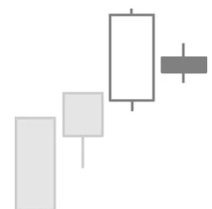

# Bearish Harami Pattern

## Kurzbeschreibung

Beim Bearish Harami umklammert eine lange weiße Kerze eine kleinere Folgekerze.

## Art der Formation

Bearische Umkehrformation

## Aufbau der Formation

Das Bearish Harami Pattern besteht aus zwei aufeinanderfolgenden Kerzen und folgt auf einen Aufwärtstrend.

Die erste Kerze des Patterns ist eine weiße Kerze mit langem Kerzenkörper.

Als Zweites folgt eine kleinere Kerze, deren Kerzenkörper sich vollständig innerhalb des Kerzenkörpers der ersten Kerze befindet. Die Spanne aus Eröffnungskurs und Schlusskurs der zweiten Kerze liegt also innerhalb der Spanne aus Eröffnungskurs und Schlusskurs der ersten Kerze.

Das bedeutet, dass die zweite Kerze mit einem Aufwärtsgap eröffnet und unterhalb des Schlusskurses der ersten Kerze geschlossen hat.

Im Gegensatz zum Körper müssen sich die Schatten der zweiten Kerze nicht innerhalb der ersten Kerze befinden.

Bei der zweiten Kerze ist die Farbe der Kerze egal. Auch ein Doji ist möglich, in diesem Fall spricht man von einem Bearish Harami Cross.

## Bedeutung

Ein Bearish Harami Pattern sagt das Ende des vorherigen Aufwärtstrends und fallende Kurse voraus.

Harami Patterns sind zwar recht bekannte Candlestick Formationen, haben aber nur eine mittelmäßige Prognosekraft, wenn es darum geht, Trendwechsel vorauszusagen. In vielen Fällen bewegt sich der Kurs nach einem Harami einfach in die vorherige Richtung weiter.

Nach dem Auftauchen eines Bearish Harami Pattern sollte daher abgewartet werden, wie sich der Kurs am Folgetag verhält.

## Trading

Die Harami Formation braucht eine Bestätigung, bevor auf fallende Kurse spekuliert werden kann.

Einigen Tradern reicht es, wenn der Kurs am Folgetag unter dem Körper der zweiten Harami Kerze eröffnet. In den meisten Fällen wird aber abgewartet, ob der Kurs unterhalb der zweiten Kerze schließt.
