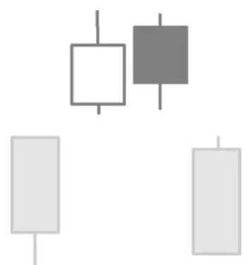

# Bearish Island Reversal Pattern

## Kurzbeschreibung

Beim Bearish Island Reversal Pattern schwebt eine Gruppe von Kerzen über den vorherigen und den nachfolgenden Kerzen.

## Art der Formation

Bearische Umkehrformation

## Aufbau der Formation

Vor der Formation befindet sich der Kurs in einem Aufwärtstrend.

Die erste Kerze der Bearish Island Reversal Formation eröffnet mit einem Aufwärtsgap, das im weiteren Handel nicht geschlossen wird. Das Tief der neuen Kerze liegt also deutlich über dem Hoch der Vorkerze.

Es folgen eine oder mehrere weitere Kerzen, die alle auf derselben Höhe wie die erste Kerze liegen. Keiner dieser Kerzen gelingt es, das Gap wieder zu schließen. Die Anzahl der Kerzen oberhalb des Gaps ist nicht wichtig. Bei den meisten Bearish Island Reversal Formationen befinden sich zwischen zwei bis zehn Kerzen oberhalb des Gaps.

Nach der Seitwärtsbewegung kommt es zu einer plötzlichen Gegenbewegung. Der Kurs eröffnet gleich zu Handelseröffnung deutlich tiefer und bildet ein Abwärtsgap aus.

Die beiden Gaps befinden sich in etwa auf gleicher Höhe und trennen die Kerzen oberhalb der Gaps von den vorherigen und den nachfolgenden Kerzen ab. Die Kerzen oberhalb der beiden Gaps bilden dadurch eine Insel, die über den übrigen Kerzen zu schweben scheint.

## Bedeutung

Im Verlauf der Formation geht der Kurs erst von einer Aufwärtsbewegung in eine Seitwärtsbewegung über und bricht dann aus dieser Seitwärtsbewegung nach unten aus.

Das Bearish Island Pattern zeigt also eine Trendumkehr an. Wird die Insel von einer größeren Anzahl von Kerzen gebildet, ist die Formation auch stark genug, um das Ende eines längerfristigen Trends anzukündigen.

## Trading

Das Bearish Island Reversal Pattern sagt fallende Kurse voraus. Taucht die Formation im Chart einer Aktie auf, würde also mit einer Short Position auf fallende Kurse gesetzt werden.

Ein Einstieg in eine Short Position sollte erst erfolgen, nachdem sich die Kerze nach dem zweiten Gap voll herausgebildet hat und klar ist, dass die Kurslücke nicht wieder geschlossen wird. Der Einstieg erfolgt entweder am Ende der Gapkerze oder am Folgetag, wenn sich der Kurs tiefer bewegt.
