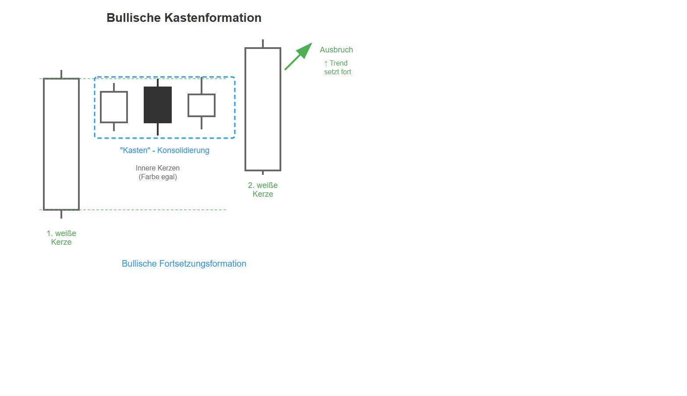

# Bullische Kastenformation

## Kurzbeschreibung

Bei der bullischen Kastenformation werden mehrere kleinere Kerzen zwischen zwei langen weißen Kerzen eingeklemmt.

## Art der Formation

**Bullische Fortsetzungsformation**

## Aufbau der Formation

Dies ist keine klassische Kerzenformation. Allerdings taucht dieses Muster so häufig im Chart auf, dass es einer Erwähnung wert ist.

Die Formation folgt auf eine Aufwärtsbewegung und beginnt mit einer weißen Kerze mit langem Kerzenkörper.

Auf die lange weiße Kerze folgen mehrere kleine Kerzen, deren Kerzenkörper sich alle innerhalb des Kerzenkörpers der ersten Kerze befinden. Die Körper dieser kleineren Kerzen befinden sich alle auf einer Linie, sodass die Kerzen nebeneinander liegen. Die Anzahl der inneren Kerzen ist bei dieser Formation egal. Ebenso ist die Farbe der inneren Kerzen unwichtig.

Die letzte Kerze der Kastenformation hingegen muss wieder einen weißen Kerzenkörper haben. Wie schon der erste Kerzenkörper umfasst auch der Körper der letzten Kerze die Kerzenkörper aller inneren Kerzen. Die kleinen Kerzen in der Mitte werden also von den beiden längeren Kerzen umschlossen.

Die weiße Kerze am letzten Tag der Formation schließt oberhalb der Hochs der vorherigen Tage. Der Körper der letzten Kerze ragt daher über alle oberen Schatten der vorherigen Kerzen heraus.

## Bedeutung

Im Verlauf einer bullischen Kastenformation geht der Kurs kurzfristig von einer Aufwärtsbewegung in eine Seitwärtsbewegung über. Am letzten Tag der Formation springt er dann aber wieder in seine ursprüngliche Aufwärtsbewegung zurück.

Vor einer bullischen Kastenformation befinden sich häufig mehrere aufeinanderfolgende weiße Kerzen. Die Aufwärtsbewegung vor der Formation ist also entsprechend steil. Nach diesem steilen Anstieg schaltet der Kurs dann aber zunächst einmal einen Gang zurück. In den folgenden Tagen bewegen sich die Kurse fast gar nicht. Diese Seitwärtsphase dient allerdings lediglich dazu, neue Energie zu tanken, die dann mit der letzten Kerze wieder schlagartig freigesetzt wird.

Generell kann gesagt werden, dass die folgende Aufwärtsbewegung umso stärker ausfallen wird, je mehr Kerzen sich in der vorherigen Seitwärtsbewegung befunden haben.

## Trading

Die Formation sagt weiter steigende Kurse voraus. Ein Einstieg in eine neue Position erfolgt entweder am Tagesende oder am Folgetag, sobald der Kurs oberhalb des oberen Schattens der letzten Kerze notiert.

---

## Zusammenfassung

| Eigenschaft | Beschreibung |
|-------------|--------------|
| **Pattern-Typ** | Bullische Fortsetzungsformation |
| **Anzahl Kerzen** | Variabel (mind. 3) |
| **Vorheriger Trend** | Aufwärtsbewegung |
| **Signal** | Fortsetzung des Aufwärtstrends |
| **Schlüsselmerkmal** | Kleine Kerzen zwischen zwei großen weißen |
| **Einstieg** | Tagesende oder über oberem Schatten |
| **Stärke** | Stärker bei längerer Konsolidierung |
| **Besonderheit** | Keine klassische Formation, aber häufig |
