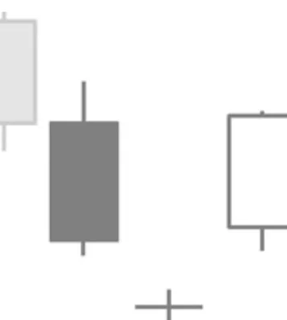

# Bullish Abandoned Baby Pattern

## Kurzbeschreibung

Beim Bullish Abandoned Baby Pattern ist eine Doji Kerze sowohl von der vorherigen als auch von der nachfolgenden Kerze durch eine Kurslücke getrennt.

## Art der Formation

Bullische Umkehrformation

## Aufbau der Formation

Die erste Kerze des Patterns ist eine schwarze Kerze mit einem langen Kerzenkörper, die auf eine Abwärtsbewegung folgt.

Am folgenden Tag eröffnet der Kurs mit einer Kurslücke unterhalb der vorherigen Kerze. Die zweite Kerze ist eine Doji Kerze, die statt eines Kerzenkörpers eine waagerechte Linie hat.

Während es am ersten Tag eine Kurslücke nach unten gab, kommt es am dritten Tag zu einer Kurslücke nach oben. Dadurch ist die Doji Kerze von den beiden über ihr liegenden Kerzen vollständig abgeschnitten.

Nach der Gaperöffnung bewegen sich die Kurse am dritten Tag weiter nach oben, sodass die Kerze einen langen weißen Kerzenkörper hat.

## Bedeutung

Der etwas ungewöhnliche Name des Abandoned Baby Patterns bezieht sich auf die kleine mittlere Kerze, die von den beiden größeren Kerzen getrennt ist wie ein ausgesetztes Baby von seinen Eltern.

Die Formation zeigt einen Trendwechsel an. Die schwarze Kerze ist noch Teil des Abwärtstrends. Auch am Folgetag deutet die Eröffnung mit dem Abwärtsgap zunächst darauf hin, dass sich die Abwärtsbewegung fortsetzt.

Dann aber kommt die Bewegung ins Stocken und es entwickelt sich ein sehr uneinheitlicher Handel, der schließlich zu der Doji Kerze führt.

Am dritten Tag beginnt dann mit der Gaperöffnung nach oben die eigentliche Trendwende. Im Folgenden setzt der Kurs seine Aufwärtsbewegung weiter fort und verstärkt damit das Umkehrsignal.

## Trading

Das Bullish Abandoned Baby Pattern kündigt weiter steigende Kurse an. Trader, die das Pattern im Chart entdecken, steigen entweder am Ende der weißen Kerze in eine Kaufposition ein oder sie warten ab, ob der Kurs am folgenden Tag über das Hoch der weißen Kerze steigt.
