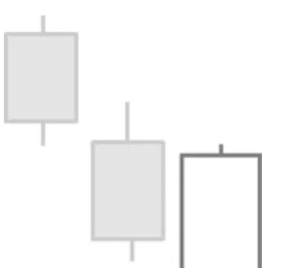

# Bullish Belt Hold Pattern

## Kurzbeschreibung

Das Bullish Belt Hold Pattern besteht aus einer einzelnen Kerze mit langem, weißem Körper und folgt auf einen Abwärtstrend.

## Art der Formation

Bullische Umkehrformation

## Aufbau der Formation

Vor der Belt Hold Kerze befand sich der Kurs in einer Abwärtsbewegung. Die Kurse sind also an den Tagen vor der Formation gefallen.

Die Belt Hold Kerze eröffnet im unteren Bereich der vorherigen Kerze. Viele Trader verlangen sogar, dass der Eröffnungskurs der neuen Kerze unterhalb des Schlusskurses der Vorkerze liegt. In diesem Fall wäre das Signal stärker, allerdings wird die tiefere Eröffnung nicht immer in der Literatur verlangt.

Nach der Eröffnung bewegt sich der Kurs nach oben und es bildet sich eine lange weiße Kerze heraus.

Die Belt Hold Kerze hat entweder keine oder nur sehr kleine untere und obere Schatten. Der Kurs ist im Tagesverlauf also nie deutlich unter seinen Eröffnungskurs gefallen und hat nah an seinem Höchstkurs geschlossen.

## Bedeutung

Die Bullish Belt Hold Kerze markiert einen Trendwechsel. Während die Kurse vor der Kerze gefallen sind, kam es am Tag der Kerze zu einer starken Aufwärtsbewegung, die den Abwärtstrend zumindest kurzfristig unterbricht.

Die Formation ist umso aussagekräftiger, je länger der Körper der weißen Kerze ist. Eine lange Kerze deutet auf eine starke Gegenbewegung hin. Viele Trader, die am Anfang des Tages oder am Vortag eine Short Position aufgebaut haben, sehen sich nun mit einem Verlust konfrontiert und werden bei weiter steigenden Kursen gezwungen sein, ihre Position wieder zu schließen.

Eine Bullish Belt Hold Kerze taucht relativ häufig im Kerzenchart auf. Oft ist die Belt Hold Kerze auch Bestandteil einer größeren Kerzenformation. Beispielsweise haben das Bullish Engulfing Pattern oder das Piercing Pattern eine Belt Hold Kerze als letzte Kerze.

## Trading

Die Formation braucht eine Bestätigung. Bevor ein Kauf getätigt wird, sollte daher abgewartet werden, bis der Kurs über das Hoch der Belt Hold Kerze steigt.

Einige Trader würden sogar erst dann in eine neue Trading Position einsteigen, wenn die folgende Kerze über dem Schlusskurs der Belt Hold Kerze schließt.
