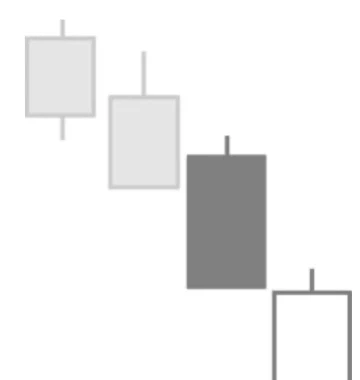

# Bullish Counterattack Pattern

## Kurzbeschreibung

Beim Bullish Counterattack Pattern eröffnet der Kurs am zweiten Tag mit einem Abwärtsgap, bewegt sich dann aber wieder zum Schlusskurs der Vorkerze zurück.

## Art der Formation

Bullische Umkehrformation

## Aufbau der Formation

Das Besondere beim Bullish Counterattack Pattern ist, dass zwei aufeinanderfolgende Kerzen zum selben Schlusskurs schließen, obwohl der Kurs bei der ersten Kerze gefallen ist, während er bei der zweiten Kerze gestiegen ist.

Beim Bullish Counterattack Pattern ist die erste Kerze eine schwarze Kerze mit langem Kerzenkörper.

Am folgenden Tag eröffnet der Kurs mit einer großen Kurslücke unterhalb der ersten Kerze. Der Eröffnungskurs der neuen Kerze liegt also deutlich unterhalb des Schlusskurses und des Tiefstkurses der vorherigen Kerze.

Dann aber beginnt der Kurs zu steigen, sodass sich eine lange weiße Kerze herausbildet. Am Ende des Tages schließt die zweite Kerze (mehr oder weniger) genau zum Schlusskurs der Vorkerze. Die untere waagerechte Linie des schwarzen Kastens liegt also auf der gleichen Höhe wie die obere waagerechte Linie des folgenden weißen Kastens.

Die Bullish Counterattack Formation befindet sich immer am Ende einer Aufwärtsbewegung.

## Bedeutung

Die Kurslücke am zweiten Tag der Formation deutet darauf hin, dass viele Anleger mit fallenden Kursen gerechnet haben.

Auf die Trader, die auf fallende Kurse spekulieren wollten, wartete dann aber eine böse Überraschung. Anstatt weiter zu fallen, bewegten sich die Kurse nach der Kurseröffnung plötzlich wieder Erwarten nach oben. Wer am Anfang des Tages eine Short Position eröffnet hatte, hielt nun plötzlich eine Verlustposition. Daraufhin begannen die ersten Trader, ihre Positionen wieder zu schließen. Trader, die die Aktie leerverkauft hatten, um so an fallenden Kursen zu verdienen, mussten dazu die geliehenen Aktien wieder zurückkaufen. Dies führte zu einem Anstieg der Nachfrage nach der Aktie und als Konsequenz daraus zu weiter steigenden Kursen.

## Trading

Ein Bullish Counterattack Pattern sagt einen Trendwechsel und steigende Kurse voraus. Erscheint diese Kursformation im Chart einer Aktie, würde diese Aktie also gekauft werden.

Der Kauf erfolgt erst, wenn der Kurs entweder über den Höchstkurs der weißen Kerze steigt oder der Kurs sogar am Folgetag oberhalb des Hochs der weißen Kerze schließt.
