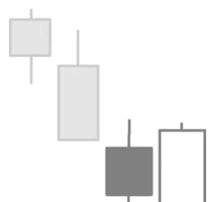

# Bullish Engulfing Pattern

## Kurzbeschreibung

Das Bullish Engulfing Pattern besteht aus einer kleineren schwarzen Kerze und einer folgenden weißen Kerze, die die erste Kerze vollständig umklammert.

## Art der Formation

Bullische Umkehrformation

## Aufbau der Formation

Die Formation besteht aus zwei aufeinanderfolgenden Kerzen und folgt auf eine Abwärtsbewegung.

Die erste Kerze der Formation ist eine Kerze mit einem schwarzen Kerzenkörper. Auf die erste Kerze folgt eine größere Kerze mit weißem Körper. Der Körper der zweiten Kerze ragt auf beiden Seiten über den Körper der ersten Kerze hinaus. Das bedeutet, dass die weiße Kerze unterhalb des Schlusskurses der schwarzen Kerze eröffnet und oberhalb des Eröffnungskurses der schwarzen Kerze schließt.

Beim Engulfing Pattern werden nur die Körper der beiden Kerzen betrachtet. Die Schatten der ersten Kerze müssen also nicht vom Körper der zweiten Kerze umklammert werden, sondern dürfen auch über diesen hinausragen.

## Bedeutung

Die erste Kerze ist als schwarze Kerze noch Teil der vorherigen Abwärtsbewegung. Auch am folgenden Tag sieht es zunächst so aus, als würde sich der Abwärtstrend weiter fortsetzen, da die Kerze mit einem Sprung nach unten eröffnet.

Dann aber gelingt es dem Kurs, sich zu erholen und er kann die Verluste des Vortags wieder wettmachen. Am Ende des Tages schließt der Kurs oberhalb des Eröffnungskurses des Vortages.

Innerhalb der beiden Tage ist es also zu einer Trendumkehr gekommen. Das Bullish Engulfing Pattern sagt daher das Ende des vorherigen Abwärtstrends und den Beginn einer Aufwärtsbewegung voraus.

## Trading

Die Formation sagt steigende Kurse voraus. Nach dem Auftauchen eines Bullish Engulfing Patterns wird daher eine Kaufposition eröffnet und auf steigende Kurse spekuliert.

Ein Kauf erfolgt in der Regel am Folgetag, sobald der Kurs über das Hoch der weißen Kerze steigt. Häufig wird dazu eine Stop Buy Order kurz oberhalb des oberen Schattens platziert.
