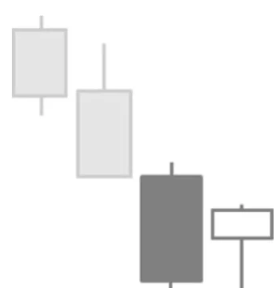

# Bullish Harami Pattern

## Kurzbeschreibung

Das Bullish Harami Pattern besteht aus einer langen schwarzen Kerze, deren Kerzenkörper den Kerzenkörper der folgenden Kerze vollständig umklammert.

## Art der Formation

Bullische Umkehrformation

## Aufbau der Formation

Harami ist das japanische Wort für schwanger. Die Kerzenformation hat ihren Namen erhalten, weil die beiden Kerzen an eine Schwangere mit ihrem Kind erinnern. Die lange Kerze symbolisiert die Mutter, während die kleine Kerze das ungeborene Kind ist, welches von der Mutter in ihrem Bauch vor sich hergetragen wird.

Bei der bullischen Variante des Harami Patterns ist die erste Kerze der Formation eine schwarze Kerze mit einem langen Kerzenkörper.

Auf die schwarze Kerze folgt eine zweite Kerze, deren Kerzenkörper deutlich kleiner ist als der Körper der ersten Kerze. Der Eröffnungskurs der zweiten Kerze befindet sich ebenso wie der Schlusskurs innerhalb des Kerzenkörpers der Vorkerze. Dadurch ragt der Körper der schwarzen Kerze an beiden Seiten über den Körper der zweiten Kerze heraus.

Im Gegensatz zur ersten Kerze ist es bei der zweiten Kerze nicht wichtig, ob die Kerze weiß oder schwarz gefärbt ist. Ebenso ist es egal, ob sich die Schatten der zweiten Kerze innerhalb oder außerhalb des Körpers der ersten Kerze befinden.

Das Bullish Harami Pattern folgt immer auf eine Abwärtsbewegung.

## Bedeutung

Nach der Abwärtsbewegung der vorherigen Tage kommt es in Form der zweiten Kerze zu einer kleinen Beruhigung. Die vorherige Bewegung ist zumindest kurzfristig unterbrochen.

Das Bullish Harami Pattern kann daher als ein erstes Zeichen für ein Abschwächen des vorherigen Trends angesehen werden. Allerdings ist es noch zu früh, um von einem Trendwechsel auszugehen. In vielen Fällen bewegt sich der Kurs an den Folgetagen einfach weiter nach unten und setzt seinen Abwärtstrend fort.

Bevor von einem Trendwechsel gesprochen werden kann, muss daher die Entwicklung an den folgenden Tagen abgewartet werden. Nur wenn sich der Kurs nach dem Harami Pattern höher bewegt, kann das Pattern als Umkehrsignal angesehen werden.

## Trading

Das Bullish Harami Pattern benötigt also eine Bestätigung, bevor auf steigende Kurse spekuliert werden kann.

Trader, die das Chartsignal handeln wollen, warten daher ab, ob die Kerze nach dem Bullish Harami Pattern über dem Körper der letzten Kerze des Patterns schließt. Das Pattern muss also durch eine Folgekerze bestätigt werden.
