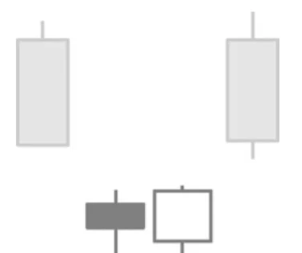

# Bullish Island Reversal Pattern

## Kurzbeschreibung

Beim Bullish Island Reversal sind mehrere aufeinanderfolgende Kerzen durch Kurslücken von den über ihnen liegenden Kerzen abgetrennt.

## Art der Formation

Bullische Umkehrformation

## Aufbau der Formation

Bei einem Island Reversal Pattern ist eine Gruppe von Kerzen sowohl von den vorherigen Kerzen als auch von den nachfolgenden Kerzen durch zwei sich gegenüberliegende Kurslücken getrennt.

Beim Bullish Reversal Pattern befinden sich die Kerzen vor der Formation in einer Abwärtsbewegung.

Die erste Kerze des bullischen Island Reversals eröffnet mit einem Abwärtsgap. Der neue Eröffnungskurs liegt also deutlich unter dem tiefsten Kurs der vorherigen Kerze. Das Gap wird über den gesamten Tag hinweg nicht geschlossen, sodass der höchste Kurs der neuen Kerze unter dem tiefsten Kurs der Vorkerze liegt.

Auf die erste Gapkerze folgen eine Reihe von weiteren Kerzen, die alle mehr oder weniger auf einer Linie liegen. Bei keiner der Kerzen bewegt sich der Kurs so weit nach oben, dass er das vorherige Gap wieder schließen kann.

Schließlich kommt es zu einem Gap in die andere Richtung. Der Kurs springt gleich zur Handelseröffnung nach oben und bildet dadurch ein Aufwärtsgap. Im Verlauf des weiteren Handels bewegt sich der Kurs weiter aufwärts, sodass die Kurslücke im Chart erkennbar bleibt.

Die beiden Gaps liegen sich im Chart direkt gegenüber, sodass eine imaginäre Linie durch die beiden Kurslücken gezogen werden kann, die die Kerzen unterhalb der Gaps von den Kerzen oberhalb der Gaps abtrennt. Die unteren Kerzen bilden dadurch eine Insel, die völlig losgelöst von den übrigen Kerzen ist.

In unserer Abbildung wird die Insel nur von zwei Kerzen gebildet. Bei einer Island Reversal Formation darf die Insel aber auch aus mehr als zwei Kerzen bestehen. Die meisten Island Formationen haben zwischen zwei bis zehn Kerzen. Bei dieser Formation ist die Farbe der einzelnen Kerzen nicht wichtig.

## Bedeutung

Das Bullish Island Reversal Pattern deutet einen Trendwechsel an. Da die Formation aus relativ vielen Kerzen besteht, kann sie auch das Ende eines etwas längeren Trends anzeigen.

Nach dem Herausbilden eines Bullish Island Reversal ist mit steigenden Kursen zu rechnen.

## Trading

Die Formation gilt erst dann als abgeschlossen, wenn eine Kerze mit einem Aufwärtsgap eröffnet und oberhalb des Gaps schließt. Ein Einstieg in eine Kaufposition würde erst erfolgen, wenn sich diese Kerze vollständig herausgebildet hat.

Der Einstieg erfolgt entweder am Ende des Tages oder am Folgetag, sobald der Kurs über das Hoch der letzten Kerze steigt.
