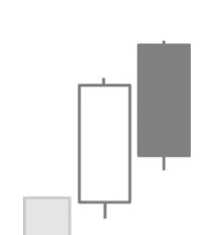

# Dark Cloud Cover

## Kurzbeschreibung

Beim Dark Cloud Cover eröffnet der Kurs der zweiten Kerze mit einem Aufwärtsgap. Dann fällt der Kurs aber wieder zurück und schließt am Ende innerhalb des Kerzenkörpers der ersten Kerze.

## Art der Formation

Bearische Umkehrformation

## Aufbau der Formation

Das Dark Cloud Cover folgt auf einen Aufwärtstrend.

Die erste Kerze des Dark Cloud Cover ist eine weiße Kerze mit einem langen Körper.

Die folgende schwarze Kerze eröffnet mit einer Kurslücke oberhalb des oberen Schattens der weißen Kerze. Im weiteren Handelsverlauf fällt der Kurs aber wieder zurück, sodass der Körper der zweiten Kerze am Tagesende weit in den Kerzenkörper der ersten Kerze hineinragt.

Viele Trader verlangen, dass die schwarze Kerze unterhalb der Mitte des Kerzenkörpers der ersten Kerze schließt, bevor die Formation als Dark Cloud Cover bezeichnet werden kann.

## Bedeutung

Das Dark Cloud Cover ist das bearische Gegenstück zum Piercing Pattern.

Nachdem der Kurs am ersten Tag stark gestiegen ist, gehen viele Investoren von weiter steigenden Kursen aus. Einige von ihnen platzieren daher schon vor Börseneröffnung Kauforders, sodass die folgende Kerze mit einem Gap nach oben eröffnet.

Dann aber beginnen die Kurse zu fallen und die morgendlichen Käufer befinden sich plötzlich in einer Verlustposition.

Die ersten Käufer beginnen nun, ihre Positionen wieder zu verkaufen, um ihre Verluste zu begrenzen. Dadurch kommt der Kurs weiter ins Rutschen, was wiederum weitere Verkäufe nach sich zieht. Die Abwärtsbewegung setzt sich fort und auch für die kommenden Tage ist dadurch eher mit fallenden Kursen zu rechnen.

## Trading

Das Dark Cloud Cover deutet auf den Beginn einer Abwärtsbewegung hin.

Ein Dark Cloud Cover im Chart einer Aktie ist ein Warnsignal für alle Anleger, die die Aktie halten. Fällt der Kurs unter das Tief der schwarzen Kerze, sollte über einen Verkauf nachgedacht werden.

Trader, die mit Hilfe einer Short Position auf fallende Kurse spekulieren wollen, sollten damit warten, bis sich der Kurs am Folgetag unter den unteren Schatten bewegt.
