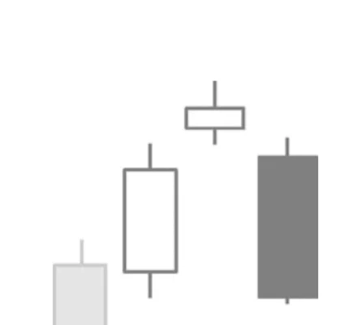

# Evening Star

## Kurzbeschreibung

Die Evening Star Formation ist eine Umkehrformation, bei der die mittlere Kerze durch ein oder zwei Gaps von der vorherigen und der nachfolgenden Kerze abgetrennt ist.

## Art der Formation

Bearische Umkehrformation

## Aufbau der Formation

Die Evening Star Formation besteht aus drei Kerzen, die auf einen Aufwärtstrend folgen. Die erste Kerze der Formation ist eine weiße Kerze mit einem langen Kerzenkörper.

Auf diese Kerze folgt eine Kerze mit einem kleinen Körper. Der Körper dieser Kerze darf sowohl schwarz als auch weiß gefärbt sein. Auch ein Doji ist möglich. In diesem Fall wird diese Formation als Evening Doji Star bezeichnet.

Zwischen der ersten und der zweiten Kerze befindet sich eine Lücke. Der Kerzenkörper der zweiten Kerze liegt dabei über dem Kerzenkörper der ersten Kerze. Wie auch schon bei der Morning Star Formation reicht es auch hier aus, wenn sich zwischen den beiden Kerzenkörpern eine Lücke befindet. Die Schatten der beiden Kerzen dürfen sich hingegen überlappen.

Als letzte Kerze folgt eine Kerze mit einem langen schwarzen Körper, der weit in die erste Kerze hineinragt. Idealerweise eröffnet die dritte Kerze mit einer Kurslücke unterhalb der mittleren Kerze.

## Bedeutung

Die Formation ist eine klassische drei Kerzen Umkehr.

Bei der ersten Kerze befindet sich der Kurs noch in einem Aufwärtstrend.

Die zweite Kerze ist ein erstes Warnsignal, das anzeigt, dass der Trend gestört sein könnte. Am Anfang des Tages sieht es noch gut für den Aufwärtstrend aus. Der Kurs eröffnet mit einem Gap nach oben, was darauf hinweist, dass viele Anleger mit weiter steigenden Kursen rechnen. Von da an gelingt es dem Kurs aber nicht mehr, deutlich weiter zu steigen, sodass der Kurs am Ende nicht weit von seinem Eröffnungskurs schließt.

Solche kleinen Kerzen finden sich in einer Trendbewegung allerdings immer wieder, ohne dass dies direkt zu einem Trendwechsel führen muss. Mit der letzten Kerze ändert sich diese Situation aber. Sowohl das zweite Gap als auch die lange schwarze Kerze zeigen starken Verkaufsdruck an. Der vorherige Aufwärtstrend ist nun klar gebrochen und es muss von weiter fallenden Kursen ausgegangen werden.

Je länger der Körper der letzten Kerze, desto stärker ist das Abwärtssignal. Auch ein langer oberer Schatten bei der zweiten Kerze kann das Signal verstärken, da er zeigt, dass der Trendwechsel schon im Verlauf der zweiten Kerze eingesetzt hat.

## Trading

Nach dem Erscheinen einer Evening Star Formation kann auf fallende Kurse spekuliert werden. Ein Einstieg in eine Short Position erfolgt am Ende des dritten Tages oder am Folgetag, sobald der Kurs unter das Tief der Vorkerze fällt.
