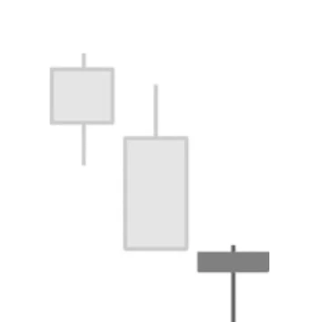
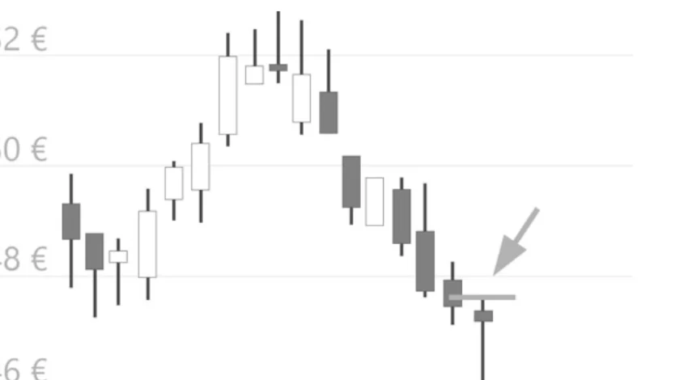

# Hammer Formation

## Kurzbeschreibung

Die Hammer Formation besteht nur aus einer einzigen Kerze mit einem langen unteren Schatten und einem kleinen Körper im oberen Bereich der Kerze.

## Art der Formation

Bullische Umkehrformation

## Aufbau der Formation

Die Hammer Formation folgt immer auf eine Abwärtsbewegung. An den Tagen vor der Kerze sind die Kurse also gefallen. In unserer Abbildung wird die Abwärtsbewegung durch die beiden grauen Kerzen angedeutet. Diese beiden Kerzen sind nicht Teil der eigentlichen Formation.

Die eigentliche Hammerkerze ist die letzte Kerze in unserer Abbildung. Wie der Name schon andeutet, hat die Kerze das Aussehen eines Hammers. Der Kopf des Hammers wird durch den kleinen Kerzenkörper im oberen Bereich der Kerze gebildet. Der lange untere Schatten stellt den Stiel des Hammers dar. Damit die Kerze als Hammerkerze gelten kann, sollte der untere Schatten mindestens doppelt so lang sein wie der Kerzenkörper.

Generell ist diese Formation umso aussagekräftiger, je länger der untere Schatten ist. Eine Hammerkerze mit besonders langem Schatten wird auch als Takuri bezeichnet.

Der obere Schatten der Kerze ist entweder nicht vorhanden oder nur sehr klein ausgeprägt. Bei dieser Formation ist es egal, welche Farbe der Körper hat. Der Körper darf also sowohl schwarz als auch weiß gefärbt sein. Auch ein Doji ist möglich.

## Bedeutung

Der untere Schatten der Kerze zeigt an, dass es im Verlauf des betrachteten Tages zu einem starken Kurseinbruch gekommen ist. Danach aber setzte der Kurs zu einer starken Gegenbewegung an, sodass er am Tagesende nahe seines Eröffnungskurses geschlossen hat.

Der Kurs hat also einen Punkt erreicht, an dem sich neue Käufer gefunden haben. Der Abwärtstrend ist damit, zumindest auf Tagesbasis, gebrochen.

## Trading

Eine Hammer Formation sagt steigende Kurse voraus. Taucht die Formation im Chart einer Aktie auf, würde die Aktie daher gekauft werden, um an einem möglichen Kursanstieg zu partizipieren.

Die meisten Trader würden nicht direkt nach dem Auftauchen der Hammerkerze in einen neuen Trade einsteigen, sondern abwarten, wie sich der Kurs am Folgetag verhält. Ein Einstieg erfolgt nur dann, wenn der Kurs über das Hoch der Hammerkerze steigt. Der Einstieg kann dabei direkt erfolgen, nachdem der Kurs über das alte Hoch gestiegen ist, oder es wird abgewartet, ob die neue Kerze über dem Hoch schließt.

Der Einstieg kann mithilfe einer Stop Kauforder erfolgen, die knapp oberhalb der grauen Linie platziert wird.

Wie bereits erwähnt, steigen einige Trader nicht schon beim Überspringen der grauen Linie ein, sondern warten ab, ob der Kurs oberhalb dieser Linie schließt.

## Beispiel

Der folgende Chart einer Aktie zeigt ein typisches Beispiel für eine Hammer Formation. Die Hammerkerze ist die letzte Kerze im Chart.

Vor der Hammerkerze kam es zu einer kurzzeitigen Abwärtsbewegung. Im Verlauf der letzten sieben Kerzen hat sich der Kurs nach unten bewegt. Mit Ausnahme der einzigen weißen Kerze sind die Kurse an allen sieben Tagen gefallen.

Am letzten Tag des Charts hat sich schließlich eine Hammerkerze herausgebildet. Die Kerze hat einen langen unteren Schatten, dagegen sind sowohl der obere Schatten als auch der Körper der Kerze nur klein ausgeprägt.

Da eine Hammer Formation einen Trendwechsel andeutet, ist am Folgetag also mit steigenden Kursen zu rechnen. Gemäß den Trading Regeln für die Hammer Formation würde die Aktie gekauft werden, sobald sich der Kurs über das Hoch der Hammerkerze bewegt hat. Im Chart ist dieser Punkt durch die kleine graue Linie (Pfeil) oberhalb der Hammerkerze markiert.
