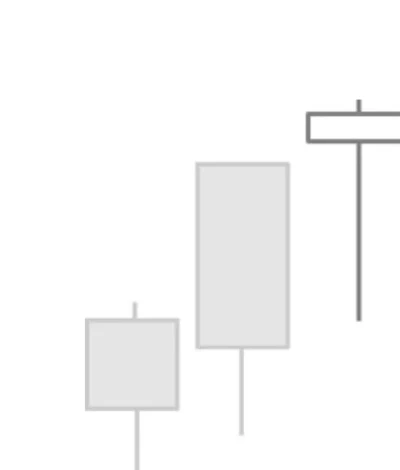

# Hanging Man

## Kurzbeschreibung

Das Hanging Man Pattern besteht aus einer einzelnen Kerze mit langem unterem Schatten und kleinem Kerzenkörper. Die Kerze befindet sich am Ende eines Aufwärtstrends.

## Art der Formation

Bearische Umkehrformation

## Beschreibung

Die Hanging Man Formation ist das bearische Gegenstück zum Inverted Hammer.

Die Kerze des Hanging Man hat einen kleinen Kerzenkörper im oberen Teil der Kerze. Bei dieser Formation ist es unwichtig, welche Farbe der Kerzenkörper hat.

Der untere Schatten der Kerze ist sehr lang und sollte mindestens die zwei- bis dreifache Länge des Kerzenkörpers haben.

Im Gegensatz dazu ist der obere Schatten entweder nicht vorhanden oder nur sehr klein.

Die Kerze des Hanging Man Pattern hat also exakt dasselbe Aussehen wie die Kerze der Hammer Formation, die Sie schon vorher kennengelernt haben. Im Unterschied zum Hammer folgt die Kerze beim Hanging Man Pattern aber nicht auf eine Abwärtsbewegung, sondern befindet sich am Ende einer Aufwärtsbewegung. Die Kerzen vor der Formation müssen sich also nach oben bewegt haben.

## Bedeutung

Die Hanging Man Formation gilt als ein Signal für einen Trendwechsel und kündigt fallende Kurse an. Allerdings benötigt die Formation eine Bestätigung durch eine Folgekerze.

Der lange untere Schatten ist eigentlich kein bearisches Zeichen. Der Schatten des Hanging Man zeigt an, dass der Kurs nach einem Kursrückgang wieder gedreht hat, um danach nahe seines Eröffnungskurses zu schließen.

Die Tatsache, dass sich der Kurs am Ende wieder nach oben bewegen konnte, deutet eher auf eine gewisse Stärke der vorherigen Aufwärtsbewegung hin. Bewegt sich der Kurs am Folgetag weiter nach oben, kann unter bestimmten Bedingungen sogar über einen Kauf nachgedacht werden.

Nur wenn es nach der Hanging Man Kerze zu einem Kursrückgang kommt, kann das Hanging Man Pattern als bearisches Zeichen gesehen werden.

Damit der Hanging Man als Verkaufssignal gelten kann, müssen die Kurse am Tag nach der Hanging Man Kerze also deutlich fallen.

## Trading

Der Hanging Man braucht unbedingt eine Bestätigung, bevor in eine Short Position eingestiegen werden kann.

Sehr risikofreudige Trader steigen bereits ein, wenn die Folgekerze deutlich tiefer eröffnet. Die meisten Trader würden aber warten, bis die folgende Kerze deutlich unterhalb der Hanging Man Kerze schließt.
