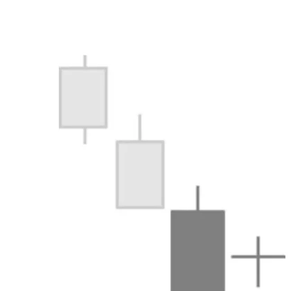

# Harami Cross

## Kurzbeschreibung

Das Harami Cross ist eine Sonderform des Harami Pattern, bei dem die letzte Kerze der Formation eine Doji Kerze ist.

## Art der Formation

Umkehrformation

## Aufbau der Formation

Wie schon in der Kurzbeschreibung erwähnt, gleicht das Harami Cross vollständig einer normalen Harami Formation, mit dem einzigen Unterschied, dass die zweite Kerze eine Doji Kerze ist.

Bei der letzten Kerze der Formation entspricht der Schlusskurs also dem Eröffnungskurs, sodass die Kerze statt eines Kerzenkörpers nur eine waagerechte Linie hat.

Vom Harami Cross gibt es zwei Varianten, eine bullische Variante und eine bearische Variante.

In der Abbildung oben sehen Sie die bullische Variante. Beim Bullish Harami Cross ist die erste Kerze des Patterns eine Kerze mit einem langen schwarzen Kerzenkörper, der die folgende Doji Kerze umklammert. Das Bullisch Harami Cross folgt auf eine Abwärtsbewegung.

Im Gegensatz dazu findet sich das Bearish Harami Cross immer am Ende einer Aufwärtsbewegung. Bei dieser Variante umklammert eine lange Kerze mit weißem Kerzenkörper die folgende Doji Kerze.

## Bedeutung

Da ein Harami Cross nur eine Sonderform der normalen Harami Formation ist, hat auch das Auftauchen eines Haramis Cross dieselbe Bedeutung wie das Erscheinen einer normalen Harami Formation.

Eine Bullish Harami Cross Formation ist ein erstes Zeichen für das bevorstehende Ende des aktuellen Abwärtstrends.

Erscheint ein Bearish Harami Cross im Chart, kann das auf einen Trendwechsel hinweisen und auf einen kommenden Kursanstieg hindeuten.

## Trading

Wie alle Harami Formationen benötigt auch das Harami Cross eine Bestätigung, bevor in eine neue Trading Position eingestiegen werden kann.

Beim Bullish Harami Cross sollte nur dann ein Kauf getätigt werden, wenn die Kerze des Folgetages eine weiße Kerze ist, die deutlich über dem Doji schließt.

Beim Bearish Harami muss die Folgekerze unterhalb des Doji schließen, ehe in eine Short Position eingestiegen werden kann.
