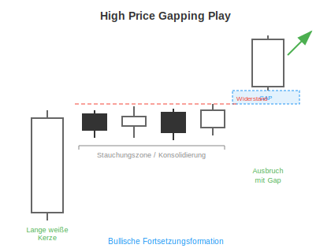

# High Price Gapping Play

## Kurzbeschreibung

Bei einem High Price Gapping Play eröffnet eine Kerze nach einer kurzen Konsolidierungsphase mit einem Aufwärtsgap.

## Art der Formation

**Bullische Fortsetzungsformation**

## Aufbau der Formation

Das High Price Gapping Play ist Teil einer Aufwärtsbewegung.

Die erste Kerze der Formation ist eine Kerze mit einem langen weißen Kerzenkörper.

Auf diese lange Kerze folgen eine Reihe von kleineren Kerzen, deren Körper sich alle in etwa auf Höhe des Schlusskurses der langen weißen Kerze befinden. Die Kerzen liegen dadurch alle mehr oder weniger auf einer Linie, sodass sich der Kurs in diesem Teil der Formation seitwärts bewegt.

Die Farbe der Kerzen innerhalb der Seitwärtsbewegung ist unwichtig. Ebenso gibt es keine Vorgaben für die Anzahl der Kerzen in der Stauchungszone. Allerdings ist die folgende Ausbruchsbewegung meistens umso stärker, je mehr Kerzen sich in der Seitwärtsbewegung befinden.

Die letzte Kerze der Formation bricht aus der Stauchungszone nach oben aus. Dabei eröffnet die Kerze gleich zu Handelsbeginn mit einer Aufwärtskurslücke und bewegt sich von da ab weiter nach oben.

## Bedeutung

Das High Price Gapping Play ist eine Fortsetzungsformation, die die Fortsetzung des vorherigen Aufwärtstrends voraussagt.

Die Stauchung in der Mitte der Formation zeigt an, dass der Aufwärtstrend eine kurzfristige Verschnaufpause eingelegt hat. Oftmals tut sich der Kurs hier schwer, über eine bestimmte Kursschwelle oberhalb der Formation zu steigen.

Dann aber gelingt es dem Kurs gleich zu Handelsbeginn, mit einem Gap aus dieser Zone auszubrechen, sodass die Aufwärtsbewegung fortgesetzt werden kann.

## Trading

Die Formation sagt weiter steigende Kurse voraus. Eine Aktie, in deren Chart solch eine Formation auftaucht, würde also gekauft werden.

Der Einstieg erfolgt entweder direkt, nachdem sich die letzte Kerze herausgebildet hat, oder am Folgetag, sobald sich der Kurs über den oberen Schatten der Vorkerze bewegt.

---

## Zusammenfassung

| Eigenschaft | Beschreibung |
|-------------|--------------|
| **Pattern-Typ** | Bullische Fortsetzungsformation |
| **Anzahl Kerzen** | Variabel (mind. 3-4) |
| **Vorheriger Trend** | Aufwärtsbewegung |
| **Signal** | Fortsetzung des Aufwärtstrends |
| **Schlüsselmerkmal** | Aufwärtsgap nach Konsolidierung |
| **Einstieg** | Nach Gap-Kerze oder über oberem Schatten |
| **Stärke** | Stärker bei längerer Konsolidierung |
