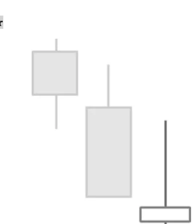

# Inverted Hammer

## Kurzbeschreibung

Die einzige Kerze der Inverted Hammer Formation ähnelt einem umgedrehten Hammer und befindet sich am Ende eines Abwärtstrends.

## Art der Formation

Bullische Umkehrformation

## Beschreibung

Wie der Name Inverted Hammer oder umgekehrter Hammer schon verrät, ähnelt das Aussehen der einzigen Kerze dieser Formation einem umgedrehten Hammer.

Der relativ kleine Körper des Inverted Hammers befindet sich im unteren Teil der Kerze. Die Farbe des Kerzenkörpers ist bei dieser Formation egal, auch eine Doji Kerze ist möglich.

Während der untere Schatten nur sehr klein oder gar nicht vorhanden ist, muss der obere Schatten deutlich länger als der Kerzenkörper sein und sollte mindestens zwei Drittel der gesamten Kerze ausmachen.

Im Idealfall eröffnet die Kerze entweder im unteren Bereich der Vorkerze oder sogar unterhalb der vorherigen Kerze.

Die Kerze der Inverted Hammer Formation folgt immer auf eine Abwärtsbewegung. An den Tagen vor der Kerze sind die Kurse also gefallen.

## Bedeutung

Wie auch bei der folgenden Hanging Man Formation ist die Inverted Hammer Kerze für sich alleine genommen nicht unbedingt ein Signal für eine Trendwende.

Zwar ist der Kurs innerhalb des betrachteten Tages kurzfristig gestiegen. Allerdings kam es noch am selben Tag zu einem Kursrückgang, sodass der Kurs am Ende des Tages nahe seines Eröffnungskurses geschlossen hat. Solch ein Kursrücksetzer deutet nicht gerade auf steigende Kurse hin.

Die Kerze an sich ist daher nicht als Umkehrsignal zu sehen. Erst wenn der Kurs am Folgetag dreht und sich erneut nach oben bewegt, ist mit einem Kursanstieg zu rechnen. Der Inverted Hammer braucht also eine Bestätigung durch die nachfolgende Kerze.

## Trading

Auf keinen Fall sollte daher direkt nach dem Auftauchen einer Inverted Hammer Kerze in eine Long Position eingestiegen werden. Stattdessen wird zunächst nur beobachtet, ob sich der Kurs am Folgetag aufwärts bewegt.

Die meisten Trader würden nur dann eine Kaufposition eröffnen, wenn der Kurs am Tagesende oberhalb der Inverted Hammer Kerze schließt. Der Einstieg erfolgt also erst am Ende der folgenden Kerze.
