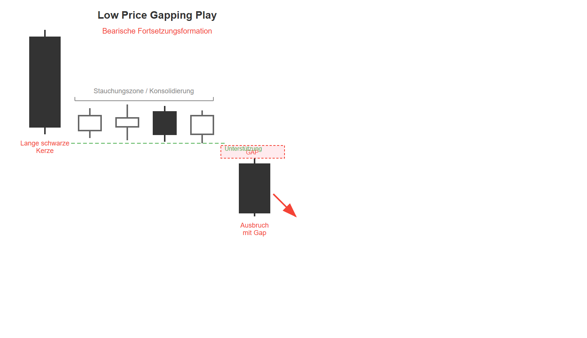

# Low Price Gapping Play

## Kurzbeschreibung

Beim Low Price Gapping Play bricht der Kurs mit einem Gap nach unten aus einer Stauchungszone aus.

## Art der Formation

**Bearische Fortsetzungsformation**

## Aufbau der Formation

Die erste Kerze der Formation ist eine Kerze mit einem langen schwarzen Kerzenkörper, die auf eine Abwärtsbewegung folgt.

Die folgenden Kerzen sind allesamt deutlich kleiner als die erste Kerze und befinden sich alle auf Höhe des Schlusskurses der ersten Kerze. Dadurch liegen die kleinen Kerzen alle auf einer waagerechten Linie. In diesem Bereich der Formation befinden sich die Kerzen also in einer Seitwärtsbewegung. Die Anzahl der Kerzen innerhalb dieser Seitwärtsbewegung ist nicht vorgegeben und schwankt meistens zwischen zwei und zehn Kerzen. Bei diesen Kerzen ist die Farbe der Kerzen egal.

Mit der letzten Kerze gelingt es dem Kurs schließlich wieder aus der Seitwärtsbewegung auszubrechen. Die letzte Kerze des Low Price Gapping Play eröffnet mit einem deutlichen Abwärtsgap. Der Kurs eröffnet also gleich zu Beginn deutlich unterhalb der unteren Schatten der vorherigen Kerzen. Nach der Eröffnung setzt der Kurs seine Abwärtsbewegung weiter fort, sodass die letzte Kerze einen langen schwarzen Kerzenkörper hat.

## Bedeutung

Das Low Price Gapping Play ist eine Fortsetzungsformation und sagt die Fortsetzung der vorherigen Abwärtsbewegung voraus.

Während der Formation kam es zu einer Stauchung, in der die Kerzen kurzfristig in eine Seitwärtsbewegung übergegangen sind. Ausbrüche aus solchen Stauchungszonen gelten als starkes charttechnisches Signal und sagen voraus, dass der Kurs sich in Richtung des Ausbruchs weiterbewegen wird.

Je länger die vorherige Seitwärtsbewegung, desto stärker ist die folgende Ausbruchsbewegung.

## Trading

Nach dem Ausbruch aus der Seitwärtsbewegung ist mit weiter fallenden Kursen zu rechnen.

Trader, die ein Low Price Gapping Play im Chart entdecken, können mit einer Short Position auf fallende Kurse setzen.

Der Einstieg in eine Short Position erfolgt entweder am Ende der zweiten schwarzen Kerze oder am Folgetag, sobald sich der Kurs tiefer bewegt.

---

## Zusammenfassung

| Eigenschaft | Beschreibung |
|-------------|--------------|
| **Pattern-Typ** | Bearische Fortsetzungsformation |
| **Anzahl Kerzen** | Variabel (mind. 3-4, oft 2-10 in Konsolidierung) |
| **Vorheriger Trend** | Abwärtsbewegung |
| **Signal** | Fortsetzung des Abwärtstrends |
| **Schlüsselmerkmal** | Abwärtsgap nach Konsolidierung |
| **Einstieg** | Nach Gap-Kerze oder bei tieferem Kurs |
| **Stärke** | Stärker bei längerer Konsolidierung |

## Vergleich: High Price vs. Low Price Gapping Play

| Merkmal | High Price Gapping Play | Low Price Gapping Play |
|---------|------------------------|----------------------|
| **Trend** | Aufwärtstrend | Abwärtstrend |
| **Erste Kerze** | Lange weiße Kerze | Lange schwarze Kerze |
| **Konsolidierung** | Am oberen Ende | Am unteren Ende |
| **Ausbruch** | Gap nach oben | Gap nach unten |
| **Signal** | Bullische Fortsetzung | Bearische Fortsetzung |
| **Position** | Long | Short |
