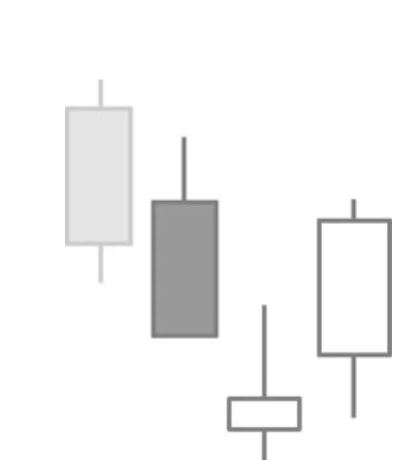

# Morning Star

## Kurzbeschreibung

Bei einer Morning Star Formation folgt auf eine lange schwarze Kerze eine kleinere Kerze, die mit einem Abwärtsgap eröffnet. Als letzte Kerze folgt eine lange weiße Kerze.

## Art der Formation

Bullische Umkehrformation

## Aufbau der Formation

Der Morning Star Formation gehen immer fallende Kurse voraus.

Die erste Kerze der Formation ist eine schwarze Kerze mit langem Kerzenkörper.

Danach folgt eine Kerze, die mit einer Lücke nach unten eröffnet und auch unterhalb des Schlusskurses der ersten Kerze schließt. Am Ende des Tages schwebt der Körper der zweiten Kerze also unterhalb des Körpers der ersten Kerze. Bei dieser Formation reicht es aus, wenn sich zwischen den beiden Kerzenkörpern eine Lücke befindet. Die Schatten der beiden Kerzen dürfen sich hingegen überlappen.

Bei der zweiten Kerze der Morning Star Formation handelt es sich um eine Kerze mit kleinem Körper. Die Farbe der Kerze ist bei dieser Kerze egal. Handelt es sich bei der Kerze um ein Doji, wird die Formation als Morning Doji Star bezeichnet.

Die letzte Kerze ist eine weiße Kerze mit langem Kerzenkörper, die mit einer Kurslücke nach oben eröffnet. Je weiter diese Kerze in den Kerzenkörper der ersten Kerze hineinragt, desto stärker ist das Chartsignal.

## Bedeutung

Das Morning Star Pattern wird zusammen mit der im nächsten Abschnitt folgenden Evening Star Formation auch als Three River Pattern bezeichnet. Das Three River Pattern gehört zu einer Gruppe von fünf Candlestick Formationen, die auch als Sakata's Five Methods bezeichnet werden. All diesen Formationen ist gemein, dass sie aus drei Kerzen bestehen.

Beim Morning Star Pattern kommt es im Verlauf der drei Kerzen zu einem Trendwechsel.

Die erste Kerze ist noch Teil der Abwärtsbewegung. Am zweiten Tag eröffnet der Tag mit einem Abwärtsgap, was zuerst auf weiter fallende Kurse hindeutet. Allerdings gelingt es dem Kurs dann im weiteren Handel nicht, sich deutlich nach unten abzusetzen. Mit der dritten Kerze kommt es schließlich zu einem klaren Trendumschwung.

## Trading

Das Morning Star Pattern sagt steigende Kurse voraus. Ein Kauf erfolgt entweder am Ende der dritten Kerze oder am folgenden Tag, sobald sich der Kurs über das Hoch der letzten Kerze bewegt hat. Sehr vorsichtige Trader warten erst ab, ob die folgende Kerze am nächsten Tag über der dritten Kerze schließt.
