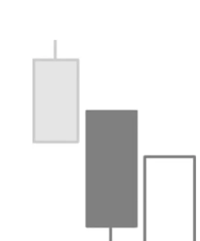

# Piercing Pattern

## Kurzbeschreibung

Das Piercing Pattern besteht aus zwei Kerzen, bei denen die zweite Kerze zwar unterhalb der ersten Kerze eröffnet, aber innerhalb der ersten Kerze schließt.

## Art der Formation

Bullische Umkehrformation

## Aufbau der Formation

Die Formation besteht aus zwei Kerzen und folgt auf eine Abwärtsbewegung.

Die erste Kerze des Piercing Patterns ist eine schwarze Kerze mit langem Kerzenkörper und kleinen Schatten.

Am Folgetag eröffnet der Kurs mit einem Abwärtsgap. Der Eröffnungskurs der Folgekerze liegt also unter dem unteren Schatten der ersten Kerze.

Im Anschluss daran beginnen die Kurse dann aber zu steigen, sodass das Gap wieder geschlossen werden kann. Am Ende schließt der Kurs oberhalb der Mitte der ersten Kerze.

Die zweite Kerze des Piercing Patterns ist also eine Kerze mit einem langen weißen Körper, der unterhalb des Tiefs der schwarzen Kerze beginnt und weit in den Körper der ersten Kerze hineinragt.

## Bedeutung

Zum Beginn der Formation sah es noch so aus, als würde sich der Abwärtstrend weiter fortsetzen. Nachdem der Kurs am ersten Tag stark gefallen war, gingen viele Anleger davon aus, dass der Kurs auch am folgenden Tag seine Abwärtsbewegung fortsetzen würde. Daher kam es zu Beginn des zweiten Tages zu einem Gap nach unten.

Die Erwartungen der Anleger bestätigten sich dann aber im weiteren Verlauf des Handels nicht und der Kurs begann stattdessen zu steigen. Anleger, die zu Beginn des zweiten Tages auf fallende Kurse spekuliert hatten, sahen sich nun unerwartet mit einem Verlust konfrontiert und begannen ihre Short Position einzudecken. Dies führte zu weiter steigenden Kursen.

Viele Short Spekulanten sind nach dem Auftauchen der Formation verunsichert, weswegen auch in den kommenden Tagen eher mit steigenden Kursen zu rechnen ist.

## Trading

Das Piercing Pattern sagt einen Kursanstieg voraus. Ein Anleger, der das Pattern im Chart einer Aktie entdeckt, würde die Aktie daher in Erwartung steigender Kurse kaufen.

Der Kauf erfolgt dabei erst, nachdem die Aktie am Folgetag über den höchsten Kurs der weißen Kerze gestiegen ist. Einige Trader steigen sogar nur dann in eine Trading Position ein, wenn die neue Kerze über dem Körper der schwarzen Kerze schließt.
