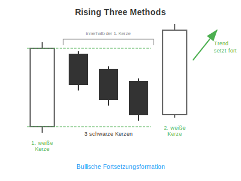
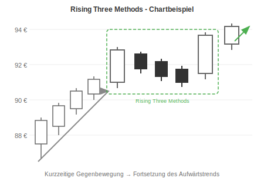

# Rising Three Methods

## Kurzbeschreibung

Bei der Rising Three Methods werden drei schwarze Kerzen von zwei längeren weißen Kerzen umklammert.

## Art der Formation

**Bullische Fortsetzungsformation**

## Aufbau der Formation

Vor dem Rising Three Methods Pattern befindet sich der Kurs in einer Aufwärtsbewegung.

Die erste Kerze des Patterns ist eine weiße Kerze mit einem langen Kerzenkörper.

Danach folgen drei kleinere Kerzen, die alle innerhalb der Handelsspanne der ersten Kerze liegen. Das bedeutet, dass sich die drei inneren Kerzen zwischen den Schatten der langen weißen Kerze befinden müssen.

Im Idealfall sind alle drei Innenkerzen schwarz gefärbt. Die drei Kerzen sollten sich entweder in einer Abwärtsbewegung oder in einer Seitwärtsbewegung befinden.

Den Abschluss bildet eine zweite weiße Kerze mit einem langen Kerzenkörper. Diese Kerze schließt über dem Schlusskurs der ersten Kerze und damit auch deutlich über den Schlusskursen der drei Innenkerzen.

## Bedeutung

Die Rising Three Methods ist die erste Fortsetzungsformation, die Sie in diesem Buch kennenlernen. Im Gegensatz zu den zuvor vorgestellten Umkehrformationen zeigt eine Fortsetzungsformation keinen Trendwechsel an, sondern sagt die Wiederaufnahme des vorherigen Trends voraus. Im Falle der Rising Three Methods ist nach Abschluss der Formation mit einer Fortsetzung des vorherigen Aufwärtstrends zu rechnen.

Nach der ersten Aufwärtskerze kam es zwar in Form der drei Innenkerzen zu einem kurzen Kursrücksetzer. Mit der letzten weißen Kerze setzte der Kurs seine vorherige Aufwärtsbewegung aber wieder fort.

Im Verlauf der Formation kommt es also zu einer kurzfristigen Gegenbewegung innerhalb eines längerfristigen Aufwärtstrends. Diese Gegenbewegung wird allerdings bereits mit der letzten Kerze der Formation wieder beendet. Nach dem Abschluss der Formation ist daher mit weiter steigenden Kursen zu rechnen.

## Trading

Das Rising Three Pattern sagt eine Fortsetzung des Aufwärtstrends voraus. Daraus resultierend kann nach Abschluss der Formation auf einen erneuten Kursanstieg spekuliert werden.

Der Einstieg erfolgt entweder direkt am Ende der zweiten weißen Kerze oder nachdem der Kurs am Folgetag über den Schatten der letzten Kerze gestiegen ist.

## Beispiel

Um den typischen Aufbau einer Fortsetzungsformation zu veranschaulichen, schauen wir uns den untenstehenden Chart an.

Der Chart zeigt den Kursverlauf einer Aktie. Die letzten fünf Kerzen im abgebildeten Chart formen eine Rising Three Formation.

Vor der eigentlichen Kerzenformation kam es zu einer kurzen Aufwärtsbewegung. In unserem Chart ist die Bewegung durch den grauen Pfeil markiert. Die Aufwärtsbewegung reicht von der weißen Kerze mit dem langen unteren Schatten bis zur ersten Kerze der Rising Three Methods Formation und erstreckt sich damit über fünf Kerzen.

Nach der langen weißen Kerze folgen drei kleinere schwarze Kerzen. Jede der drei kleinen Kerzen schließt unterhalb der vorherigen Kerze. Nach dem vorherigen Kursanstieg bewegen sich die Kurse in diesem Bereich also kurzzeitig nach unten.

Dann aber folgt die Gegenbewegung in Form der zweiten langen weißen Kerze. Die weiße Kerze schließt über allen vorherigen Kerzen, sodass der Kurs wieder in seinen vorherigen Aufwärtstrend zurückfällt.

Die kurzfristige Abwärtsbewegung ist also mit der letzten Kerze wieder beendet. Im Folgenden ist daher mit der Fortsetzung der vorherigen Aufwärtsbewegung zu rechnen.

Nach Abschluss der Formation kann auf steigende Kurse spekuliert werden. Der Einstieg erfolgt, sobald sich der Kurs über das Hoch der letzten Kerze bewegt.

---

## Zusammenfassung

| Eigenschaft | Beschreibung |
|-------------|--------------|
| **Pattern-Typ** | Bullische Fortsetzungsformation |
| **Anzahl Kerzen** | 5 (2 weiße + 3 schwarze innere Kerzen) |
| **Vorheriger Trend** | Aufwärtsbewegung |
| **Signal** | Fortsetzung des Aufwärtstrends |
| **Einstieg** | Ende der 2. weißen Kerze oder Ausbruch über Schatten |
| **Charakteristik** | Kurzfristige Gegenbewegung im Aufwärtstrend |
| **Stärke** | Moderate bis starke Fortsetzungsformation |
