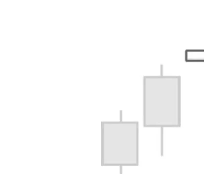
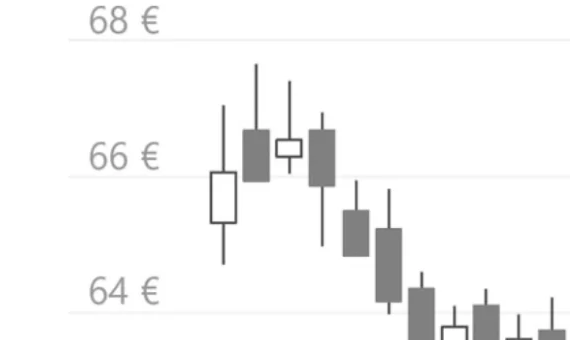

# Shooting Star

## Kurzbeschreibung

Ein Shooting Star ist eine einzelne Kerze mit einem kleinen Körper im unteren Bereich und einem langen oberen Schatten.

## Art der Formation

Bearische Umkehrformation

## Aufbau der Formation

Ein Shooting Star folgt immer auf eine Aufwärtsbewegung. An den Tagen vor der Kerze kam es also zu einem Kursanstieg.

Als Star wird eine kleine Kerze bezeichnet, die durch eine Kurslücke von der vorherigen Kerze getrennt ist. Nach der engeren Definition dieser Formation muss sich also zwischen der Shooting Star Kerze und ihrer Vorkerze ein Gap befinden (wie in unserer Abbildung). Viele Trader würden die Formation allerdings auch dann traden, wenn sich zwischen den beiden Kerzen kein Gap befindet. In diesem Fall sollte sich die Shooting Star Kerze allerdings im oberen Bereich der Vorkerze befinden.

Charakteristisch für die Shooting Star Kerze ist der lange obere Schatten. Der Schatten sollte mindestens die doppelte Länge des Körpers haben.

Der sehr kleine Körper der Shooting Star Kerze befindet sich im unteren Bereich der Kerze. Bei dieser Formation ist die Farbe des Körpers unwichtig. Der untere Schatten ist entweder nicht vorhanden oder sehr klein.

## Bedeutung

An der Form der Shooting Star Kerze kann abgelesen werden, dass es an dem betrachteten Tag zuerst zu einem starken Kursanstieg gekommen ist. Der Kurs setzte also die Aufwärtsbewegung der Vortage zunächst fort.

Dann aber wendete sich das Blatt und die Kurse begannen zu fallen. Am Ende des Tages landete der Kurs wieder im Bereich seines Eröffnungskurses. Es kam also im Verlauf des betrachteten Tages zu einem Trendwechsel.

Im Gegensatz zum oberen Schatten ist der untere Schatten fast nicht vorhanden. Der Körper der Kerze ist ebenfalls nur sehr klein, sodass der obere Schatten mehr als zwei Drittel der Gesamtkerze ausmacht. Die Kerze erfüllt damit alle Kriterien für einen Shooting Star.

Fällt der Kurs am Folgetag unter den unteren Schatten der letzten Kerze, kann daher eine Short Position eröffnet werden, um auf fallende Kurse zu spekulieren.

## Trading

Ein Shooting Star stellt häufig den höchsten Punkt einer Aufwärtsbewegung dar und sagt fallende Kurse voraus.

Ein Trader, der eine Aktie besitzt, in deren Chart ein Shooting Star erscheint, sollte daher über den Verkauf der Aktie nachdenken.

Es besteht auch die Möglichkeit, mithilfe einer Short Position nach Auftauchen einer Shooting Star Formation auf fallende Kurse zu spekulieren. Private Trader können beispielsweise mit Put Optionsscheinen, Knock Out Zertifikaten oder CFDs auf einen Kursrückgang setzen.

Der Einstieg in eine Short Position würde erst erfolgen, nachdem der Kurs am Folgetag unter den unteren Schatten des Shooting Stars gefallen ist. Alternativ kann auch erst eingestiegen werden, wenn der Kurs am Folgetag unterhalb des unteren Schattens schließt.

## Beispiel

Auch zum Shooting Star sehen wir uns ein Beispiel an.

Im Chart oben ist die letzte Kerze im Chart die Shooting Star Kerze.

Vor der Shooting Star Kerze hat sich der Kurs kurzfristig nach oben bewegt. Drei der letzten vier Kerzen vor dem Star sind weiße Kerzen, die alle oberhalb ihrer Vorkerzen geschlossen haben. Die eine schwarze Kerze ist ein Ausreißer und ändert nichts daran, dass sich der Kurs vor der Shooting Star Kerze in einer Aufwärtsbewegung befunden hat.

Am Tag der eigentlichen Shooting Star Kerze hat der Kurs mit einem Sprung nach oben eröffnet. Die Kerze scheint dadurch über ihrer Vorkerze zu schweben. Während des Handels ist der Kurs zuerst stark gestiegen. Dann kam es aber zu einer ebenso starken Gegenbewegung, sodass sich am Ende des Tages ein langer oberer Schatten gebildet hat.

Im Gegensatz zum oberen Schatten ist der untere Schatten fast nicht vorhanden. Der Körper der Kerze ist ebenfalls nur sehr klein, sodass der obere Schatten mehr als zwei Drittel der Gesamtkerze ausmacht. Die Kerze erfüllt damit alle Kriterien für einen Shooting Star.

Fällt der Kurs am Folgetag unter den unteren Schatten der letzten Kerze, kann daher eine Short Position eröffnet werden, um auf fallende Kurse zu spekulieren.
