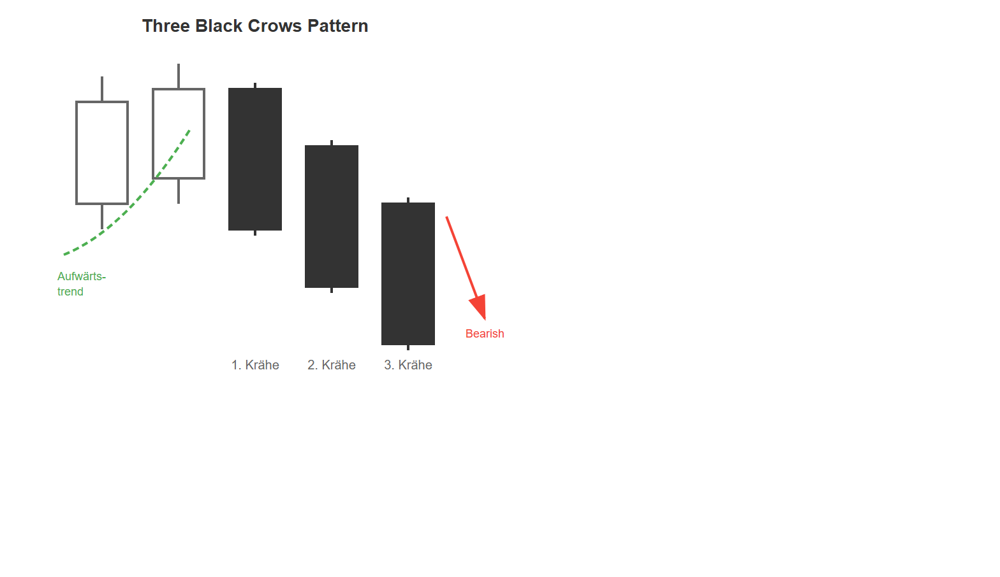

# Three Black Crows Pattern

## Kurzbeschreibung

Das Three Black Crows Pattern besteht aus drei aufeinanderfolgenden schwarzen Kerzen.

## Art der Formation

**Bearische Umkehrformation**

## Aufbau der Formation

Vor der Three Black Crows Formation befand sich der Kurs in einer Aufwärtsbewegung.

Die Formation selbst besteht aus drei aufeinanderfolgenden schwarzen Kerzen. Alle drei Kerzen sollten einen langen Körper ohne lange obere und untere Schatten haben. Die kleinen unteren Schatten zeigen an, dass es an den betrachteten Tagen nach dem Kurseinbruch nicht mehr zu einer Kurserholung gekommen ist.

Die zweite und dritte Kerze der Formation schließen beide unterhalb des Körpers ihrer Vorkerze. Der Schlusskurs der beiden Kerzen liegt also jeweils unter dem Schluss des Vortages.

Manchmal wird verlangt, dass sich die Kerzenkörper der aufeinanderfolgenden Kerzen überlappen. In diesem Fall liegt also der Eröffnungskurs der zweite und dritten schwarzen Kerze innerhalb des Körpers der vorherigen Kerze.

## Bedeutung

Die drei schwarzen Kerzen zeigen deutlich an, dass die vorherige Aufwärtsbewegung gebrochen und der Kurs in eine Abwärtsbewegung übergegangen ist.

Das Three Black Crows Pattern ist ein relativ starkes Chartsignal, das auch das Ende eines etwas längeren Aufwärtstrends anzeigen kann.

## Trading

Da das Three Black Crow Pattern fallende Kurse voraussagt, sollte eine bestehende Long Position verkauft werden und/oder mit Hilfe einer Short Position auf fallende Kurse spekuliert werden.

### Einstieg

Ein Einstieg in eine Short Position würde erfolgen, sobald der Kurs unter das Tief der dritten schwarzen Kerze fällt.

### Wichtiger Hinweis

Das Problem bei dieser Candlestick Formation ist, dass der Kurs am Ende der dritten Kerze bereits relativ weit gefallen ist. Ein Großteil der Abwärtsbewegung ist daher bereits vorbei, bevor in die Formation eingestiegen werden kann.

---

## Zusammenfassung

| Eigenschaft | Beschreibung |
|-------------|--------------|
| **Pattern-Typ** | Bearische Umkehrformation |
| **Anzahl Kerzen** | 3 |
| **Vorheriger Trend** | Aufwärtsbewegung |
| **Signal** | Verkauf / Short |
| **Einstieg** | Unter dem Tief der dritten Kerze |
| **Stärke** | Relativ stark |
