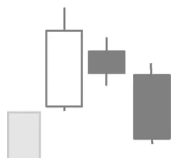

# Three Inside Down Pattern

## Kurzbeschreibung

Diese Kerzenformation besteht aus drei Kerzen, von denen die letzte Kerze eine schwarze Kerze ist, die unterhalb der beiden anderen Kerzen schließt.

## Art der Formation

Bearische Umkehrformation

## Aufbau der Formation

Die Three Inside Down Formation beginnt mit einer weißen Kerze mit einem langen Kerzenkörper, die auf eine Aufwärtsbewegung folgt.

Als Zweites folgt eine kleine schwarze Kerze, die mit einem Abwärtsgap eröffnet und oberhalb des Eröffnungskurses der ersten Kerze schließt. Der Kerzenkörper der zweiten Kerze befindet sich dadurch vollkommen innerhalb des Körpers der ersten Kerze.

Als Letztes folgt eine zweite schwarze Kerze. Diese Kerze hat einen langen Kerzenkörper und schließt unterhalb des Schattens der ersten Kerze. Das untere Ende des Kerzenkörpers der letzten Kerze befindet sich damit also unterhalb der Kerzenkörper der beiden vorherigen Kerzen.

## Bedeutung

Im Verlauf des Three Inside Down Patterns dreht der Kurs von einer Aufwärtsbewegung in eine Abwärtsbewegung.

Die erste Kerze der Formation ist als weiße Kerze noch Teil der vorherigen Aufwärtsbewegung.

Mit der zweiten Kerze kommt es bereits zu einer ersten Unterbrechung der Trendbewegung. Dem Kurs gelingt es an diesem Tag nicht, sich weiter aufwärts zu bewegen.

Am dritten Tag geht der Kurs schließlich in Form der langen schwarzen Kerze in eine Abwärtsbewegung über. Alle Anleger, die am Tag der ersten Kerze in eine Kaufposition eingestiegen sind, halten nun eine Verlustposition.

## Trading

Die Formation sagt fallende Kurse voraus. Taucht eine Three Inside Down Formation im Chart einer Aktie auf, sollte eine bestehende Position verkauft werden.

Daneben kann mithilfe einer Short Position auf fallende Kurse spekuliert werden. In diesem Falle erfolgt der Einstieg entweder am Ende der letzten Kerze oder am folgenden Tag, falls der Kurs unter das Tief der letzten Kerze der Formation fällt.
