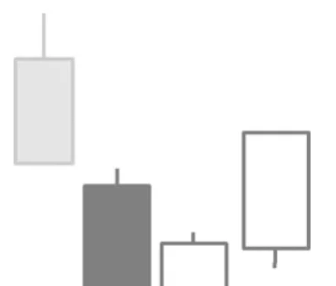

# Three Inside Up Pattern

## Kurzbeschreibung

Beim Three Inside Up Pattern folgen auf eine lange schwarze Kerze zwei weiße Kerzen, die sich in die Gegenrichtung bewegen.

## Art der Formation

Bullische Umkehrformation

## Aufbau der Formation

Vor dem Three Inside Up Pattern sind die Kurse gefallen. Auch die erste Kerze der Formation ist noch Teil der Abwärtsbewegung und hat einen langen schwarzen Kerzenkörper.

Die zweite Kerze des Patterns ist eine weiße Kerze, die oberhalb des Schlusskurses der ersten Kerze eröffnet und unterhalb des Eröffnungskurses der schwarzen Kerze schließt. Dadurch befindet sich der Kerzenkörper der weißen Kerze vollkommen innerhalb des Kerzenkörpers der ersten Kerze. Die beiden Kerzen bilden also eine Bullish Harami Formation, die Sie bereits einige Seiten zuvor kennengelernt haben.

Die letzte Kerze des Patterns ist eine zweite weiße Kerze mit einem langen Kerzenkörper. Diese Kerze schließt oberhalb des Schattens der ersten Kerze. Der Schlusskurs der letzten Kerze liegt damit über dem Höchstkurs der ersten Kerze.

## Bedeutung

Dies ist eine der wenigen Kerzenformationen, die ihren Ursprung nicht in Japan haben. Stattdessen wurde diese Formation erst vor wenigen Jahren von Gregory Morris (2006) vorgestellt.

Im Abschnitt über das Bullish Harami Pattern haben Sie bereits gelernt, dass das Harami Pattern nur dann als Umkehrsignal gilt, wenn die auf das Pattern folgende Kerze oberhalb der zweiten Kerze schließt. Das Three Inside Up Pattern ist also quasi ein Bullish Harami Pattern mit der nachfolgenden Kerze als Bestätigung. Folglich sagt das Three Inside Up Pattern eine Trendumkehr und steigende Kurse voraus.

## Trading

Nach dem Erscheinen einer Three Inside Up Formation würde auf steigende Kurse spekuliert werden. Ein Kauf erfolgt entweder am Ende der dritten Kerze oder am Folgetag, sobald der Kurs über dem Hoch der dritten Kerze notiert.
