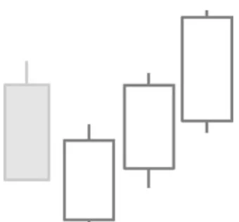

# Three White Advancing Soldiers

## Kurzbeschreibung

Die Formation besteht aus drei weißen Kerzen mit langen Kerzenkörpern und kleinen Schatten.

## Art der Formation

Bullische Umkehrformation

## Aufbau der Formation

Die Formation ist sowohl unter dem Namen Three White Soldiers Pattern als auch als Three White Advancing Soldiers Formation bekannt.

Das Three White Soldiers Pattern folgt immer auf einen Abwärtstrend. Vor der Formation sind die Kurse also gefallen.

Auf die Abwärtsbewegung folgen drei aufeinanderfolgende weiße Kerzen mit langen Kerzenkörpern und kleinen oberen und unteren Schatten. Wichtig ist vor allem, dass die oberen Schatten der Kerzen relativ klein sind. Dies zeigt an, dass es nach dem Kursanstieg keine größeren Rücksetzer mehr gegeben hat.

Die beiden letzten Kerzen der Formation sollten jeweils oberhalb des Schlusskurses der vorherigen Kerze schließen. Dadurch ragen die zweite und die dritte Kerze beide über ihre direkten Vorgängerinnen heraus.

Im Idealfall haben die beiden letzten Kerzen innerhalb des Körpers ihrer Vorkerze eröffnet. In diesem Fall würden die drei Kerzen überlappen, wie in unserer Abbildung. Es ist aber auch zulässig, wenn die Kerzen oberhalb des letzten Schlusskurses eröffnen.

## Bedeutung

Drei aufeinanderfolgende weiße Kerzen zeigen an, dass der Kurs bereits stark gestiegen ist und deuten auf weiter steigende Kurse hin. Der vorherige Abwärtstrend ist also beendet.

## Trading

Taucht das Three White Soldiers Pattern im Chart einer Aktie auf, würde die Aktie in Erwartung von steigenden Kursen gekauft werden.

Der Kauf erfolgt, sobald der Kurs über den oberen Schatten der dritten weißen Kerze steigt.

Im Unterschied zu den meisten anderen Candlestick Formationen hat sich der Kurs bei dieser Formation schon über einen längeren Zeitraum nach oben bewegt. Ein größerer Teil der Aufwärtsbewegung ist also schon vorbei, bevor die Formation abgeschlossen ist und in die Aktie eingestiegen werden kann.
