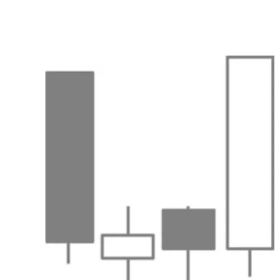

# Tower Bottom

## Kurzbeschreibung

Bei einem Tower Bottom werden mehrere kleine Kerzen von einer schwarzen Kerze am Anfang und einer weißen Kerze am Ende umklammert.

## Art der Formation

Bullische Umkehrformation

## Aufbau der Formation

Eine Tower Bottom Formation bildet sich immer am Ende eines Abwärtstrends aus.

Die erste Kerze des Tower Bottoms ist eine schwarze Kerze mit einem überdurchschnittlich langen Kerzenkörper.

Danach folgen mehrere deutlich kleinere Kerzen, die sich alle entweder im unteren Bereich der ersten Kerze oder unterhalb der ersten Kerze befinden. In der Abbildung hat die Tower Formation zwei Innenkerzen. Dies ist die Minimalzahl, mehr Kerzen sind aber zulässig. Die Farbe der inneren Kerzen ist bei dieser Formation egal.

Als Letztes folgt eine weiße Kerze mit einem langen Kerzenkörper, der deutlich oberhalb der kleineren Kerzen schließt und keinen ausgeprägten oberen Schatten hat.

Bei der Tower Bottom Formation umranden also die beiden langen äußeren Kerzen die kleineren Kerzen in der Mitte.

## Bedeutung

Die Tower Bottom Formation ist eine Umkehrformation, die sich über eine größere Anzahl von Kerzen erstreckt.

Am Ende der ersten Kerze befindet sich der Kurs noch in der Abwärtsbewegung. Dann aber geht er in eine mehrtägige Seitwärtsbewegung über, aus der er mit der letzten Kerze nach oben ausbricht. Die letzte Kerze ist eine Kerze mit einem langen Kerzenkörper, was darauf hinweist, dass die Kurse weiter steigen werden.

Die meisten Tower Formationen haben nur zwei bis drei Innenkerzen. Eine Tower Formation mit deutlich mehr Innenkerzen kann auch das Ende eines längerfristigen Abwärtstrends einläuten.

## Trading

Trader, die diese Formation im Chart entdecken, würden auf steigende Kurse spekulieren.

Ein Einstieg erfolgt entweder, nachdem sich die lange weiße Kerze herausgebildet hat oder am folgenden Tag, sobald sich der Kurs über das Hoch der weißen Vorkerze bewegt.
