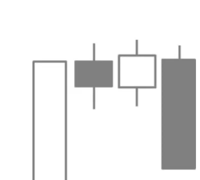

# Tower Top

## Kurzbeschreibung

Bei der Tower Top Formation wird eine Reihe von kleineren Kerzen von zwei größeren Kerzen umfasst.

## Art der Formation

Bearische Umkehrformation

## Aufbau der Formation

Eine Tower Top Formation befindet sich immer am Ende einer Aufwärtsbewegung.

Die erste Kerze der Formation ist eine weiße Kerze mit einem überdurchschnittlich langen Kerzenkörper.

Auf die lange Kerze folgt eine Reihe von kleineren Kerzen, die sich alle entweder im oberen Bereich der ersten Kerze oder knapp oberhalb der Kerze befinden. In den meisten Fällen schwankt die Anzahl dieser kleineren Kerzen zwischen zwei bis zehn Kerzen. Die Farbe der Kerzenkörper ist bei diesen inneren Kerzen egal.

Dann kommt es zu einer starken Kursbewegung nach unten. Auf die kleineren Kerzen folgt eine schwarze Kerze mit langem Kerzenkörper und ohne ausgeprägten unteren Schatten, die deutlich unterhalb der Kerzen im Inneren der Formation schließt.

Die Kerzen in der Mitte der Formation befinden sich also zwischen den beiden flankierenden großen Kerzen. Dadurch hat die Formation das Aussehen eines Turmes. Die beiden äußeren Kerzen sind die flankierenden Mauern, während die kleineren inneren Kerzen das Dach bilden.

Statt der beiden großen Kerzen ist es auch zulässig, wenn sich auf einer der beiden Seiten anstelle einer überdurchschnittlich langen Außenkerze zwei direkt aufeinanderfolgende gleichfarbige Kerzen von normaler Größe befinden. In diesem Fall ist die Aufwärts- oder Abwärtsbewegung auf zwei Tage verteilt.

## Bedeutung

Anders als bei den meisten Candlestick Formationen dauert es bei dieser Formation mehrere Tage, bis der Trendwechsel vollzogen ist.

Nach dem sehr steilen Anstieg kommt es zu einer kurzfristigen Stauchungsphase, die in eine ebenso steile Abwärtsbewegung übergeht.

## Trading

Die Tower Top Formation kündigt fallende Kurse ein. Nach dem Erscheinen der Formation kann daher mithilfe einer Short Position auf fallende Kurse spekuliert werden.

Der Einstieg erfolgt entweder am Ende des Tages, an dem sich die lange Abwärtskerze herausgebildet hat, oder am Folgetag, sobald der Kurs unter das Tief der Abwärtskerze fällt.
