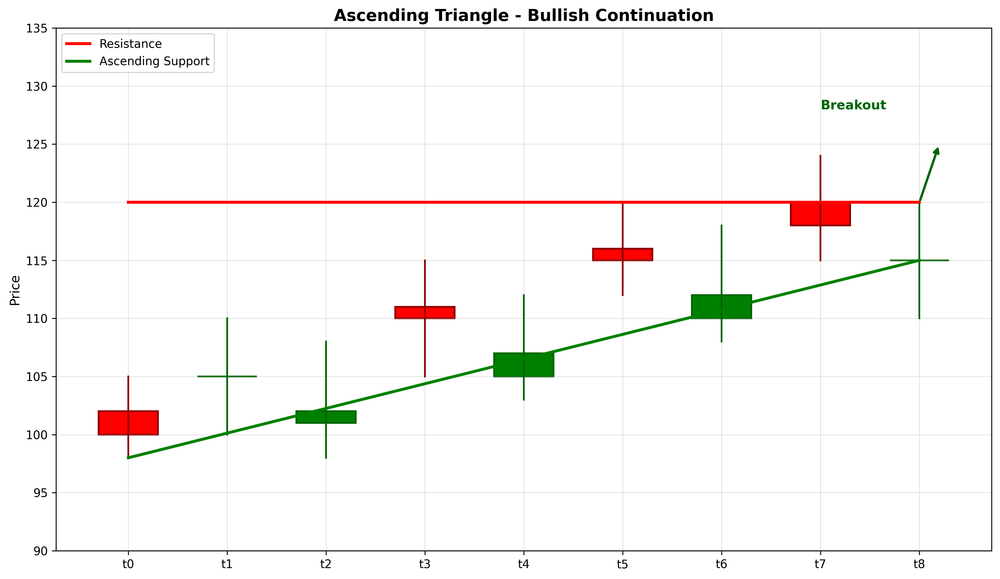

# Ascending Triangle

## Kurzbeschreibung

Das Ascending Triangle Pattern ist eine bullische Fortsetzungsformation mit einer horizontalen Widerstands-Linie (Oberseite) und einer aufsteigenden Trendlinie (Unterseite). Der Kurs bewegt sich in einem dreieckigen Bereich, wobei jeder Rückgang höher ist als der vorherige.

## Art der Formation

**Bullische Fortsetzungsformation**

## Aufbau der Formation

Das Ascending Triangle entsteht typischerweise in einem Aufwärtstrend und signalisiert die Fortsetzung dieses Trends.

Die **horizontale Widerstands-Linie** wird durch mehrere Hochpunkte auf nahezu gleichem Niveau gebildet. Der Markt testet diesen Widerstand mehrfach, kann ihn aber (noch) nicht durchbrechen.

Die **aufsteigende Trendlinie** wird durch steigende Tiefpunkte gebildet. Jeder Rückgang findet Unterstützung auf einem höheren Niveau als zuvor.

Diese Kombination zeigt, dass Käufer stärker werden (höhere Tiefpunkte), während Verkäufer schwächer werden (gleiche Hochpunkte).

Der Bruch über die Widerstands-Linie aktiviert das Muster und signalisiert eine bullische Bewegung.

## Bedeutung

Das Ascending Triangle deutet auf ein Ungleichgewicht zwischen Angebot und Nachfrage hin. Käufer drücken den Kurs immer höher, werden aber am Widerstands-Niveau abgewehrt.

Der dreieckige Quetsch zeigt, dass Volatilität abnimmt, während die Spannung aufbaut. Der Bruch kommt typically explosiv.

## Trading

**Einstiegspunkt**: Bruch über die Widerstands-Linie mit erhöhtem Volumen.

**Preisziel**: Die Höhe des Dreiecks (Widerstands-Niveau minus tiefster Punkt) wird vom Ausbruchs-Punkt nach oben gemessen.

**Stop Loss**: Unter der aufsteigenden Trendlinie oder unter dem letzten signifikanten Tiefpunkt.

### Falscher Alarm

Ein falscher Alarm tritt auf, wenn der Kurs unter die Trendlinie fällt, anstatt über den Widerstand zu brechen.

---

## Zusammenfassung

| Eigenschaft | Beschreibung |
|-------------|--------------|
| **Pattern-Typ** | Bullische Fortsetzungsformation |
| **Komponenten** | Horizontale Resistance + Steigende Trendlinie |
| **Kontext** | Aufwärtstrend |
| **Signal** | Steigende Kaufkraft, bevorstehender Ausbruch |
| **Einstieg** | Bruch über Widerstand |
| **Preisziel** | Dreiecks-Höhe vom Ausbruchs-Punkt |
| **Stop Loss** | Unter der Trendlinie |
| **Zuverlässigkeit** | Hoch |
| **Invalidierung** | Bruch unter Trendlinie |
| **Stärke** | Stark |
