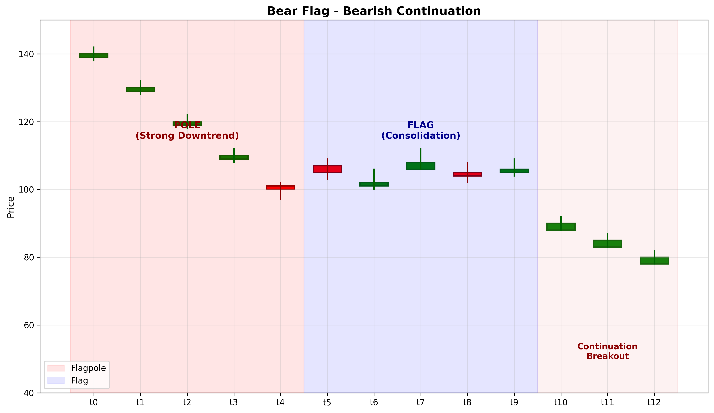

# Bear Flag

## Kurzbeschreibung

Das Bear Flag Pattern ist eine bärische Fortsetzungsformation bestehend aus zwei Teilen: dem "Flaggenmast" (starker Rückgang) und der "Flagge" (Konsolidierung mit leichtem Anstieg). Die Formation signalisiert eine Unterbrechung des Abwärtstrends vor dem Fortgang.

## Art der Formation

**Bärische Fortsetzungsformation**

## Aufbau der Formation

Das Bear Flag bildet sich nach einem starken Rückgang.

Der **Flaggenmast** ist ein steiler, schneller Rückgang des Kurses. Diese Phase zeigt starke Verkaufskraft und große Dynamik.

Die **Flagge** ist eine Konsolidierungs-Phase nach dem Mast. Der Kurs zieht sich zurück (steigt leicht an), aber nicht drastisch. Typischerweise steigt der Kurs um 25-50% des Mastes an.

Die Flagge wird oft von zwei parallelen Trendlinien gebildet, die leicht nach oben geneigt sind. Dies zeigt, dass Käufer zwar Gegendruck machen, aber nicht die Kontrolle übernehmen.

Das Volumen sinkt während der Flagge und steigt bei einem Bruch unter die Flagge.

## Bedeutung

Das Bear Flag signalisiert eine Verschnaufpause in einem starken Abwärtstrend. Verkäufer sind nur vorübergehend schwächer, aber der Trend bleibt intakt.

Die Formation sieht aus wie eine Flagge auf einem Mast und symbolisiert die Fortsetzung des Trends nach unten.

## Trading

**Einstiegspunkt**: Bruch unter die untere Grenze der Flagge mit steigendem Volumen.

**Preisziel**: Die Länge des Mastes wird vom Ausbruchs-Punkt nach unten gemessen.

**Stop Loss**: Über der Flagge oder über dem Flaggen-Hoch.

### Falscher Alarm

Ein falscher Alarm tritt auf, wenn der Kurs über die Flagge bricht, anstatt unter sie auszubrechen.

---

## Zusammenfassung

| Eigenschaft | Beschreibung |
|-------------|--------------|
| **Pattern-Typ** | Bärische Fortsetzungsformation |
| **Komponenten** | Steiler Rückgang + Rechteck-Flagge |
| **Kontext** | Starker Abwärtstrend |
| **Signal** | Pause vor Fortsetzung |
| **Einstieg** | Bruch unter Flagge |
| **Preisziel** | Mast-Länge vom Bruchs-Punkt |
| **Stop Loss** | Über Flagge |
| **Zuverlässigkeit** | Hoch |
| **Invalidierung** | Bruch über Flagge |
| **Stärke** | Stark |
