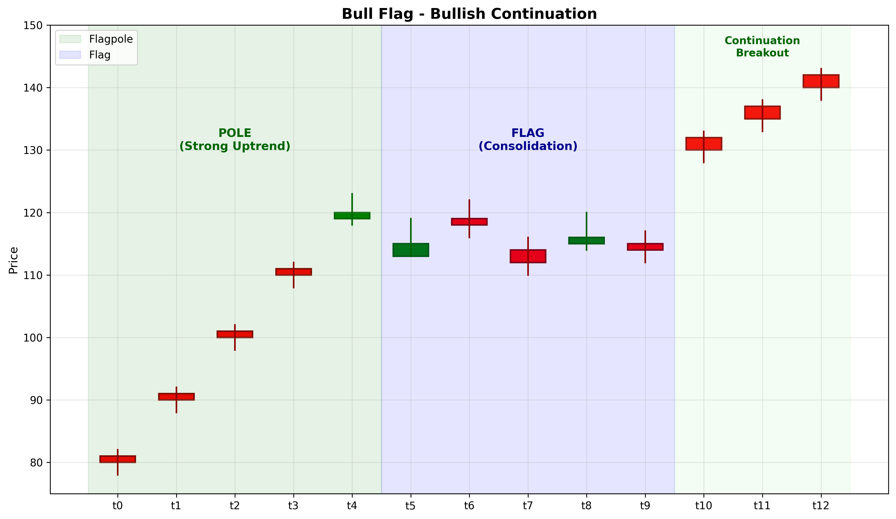

# Bull Flag

## Kurzbeschreibung

Das Bull Flag Pattern ist eine bullische Fortsetzungsformation bestehend aus zwei Teilen: dem "Flaggenmast" (starker Anstieg) und der "Flagge" (Konsolidierung mit leichtem Rückgang). Die Formation signalisiert eine Unterbrechung des Aufwärtstrends vor dem Fortgang.

## Art der Formation

**Bullische Fortsetzungsformation**

## Aufbau der Formation

Das Bull Flag bildet sich nach einem starken Anstieg.

Der **Flaggenmast** ist ein steiler, schneller Anstieg des Kurses. Diese Phase zeigt starke Kaufkraft und große Dynamik.

Die **Flagge** ist eine Konsolidierungs-Phase nach dem Mast. Der Kurs zieht sich zurück, aber nicht drastisch. Typischerweise fallen die Kurse um 25-50% des Masts zurück.

Die Flagge wird oft von zwei parallelen Trendlinien gebildet, die leicht nach unten geneigt sind. Dies zeigt, dass Verkäufer zwar Druck machen, aber nicht die Kontrolle übernehmen.

Das Volumen sinkt während der Flagge und steigt bei einem Bruch über die Flagge.

## Bedeutung

Das Bull Flag signalisiert eine Verschnaufpause in einem starken Aufwärtstrend. Käufer sind nur vorübergehend schwächer, aber der Trend bleibt intakt.

Die Formation sieht aus wie eine Flagge auf einem Mast und symbolisiert die Fortsetzung des Trends.

## Trading

**Einstiegspunkt**: Bruch über die obere Grenze der Flagge mit steigendem Volumen.

**Preisziel**: Die Länge des Mastes wird vom Ausbruchs-Punkt nach oben gemessen.

**Stop Loss**: Unter der Flagge oder unter dem Flaggen-Tief.

### Falscher Alarm

Ein falscher Alarm tritt auf, wenn der Kurs unter die Flagge bricht, anstatt über sie auszubrechen.

---

## Zusammenfassung

| Eigenschaft | Beschreibung |
|-------------|--------------|
| **Pattern-Typ** | Bullische Fortsetzungsformation |
| **Komponenten** | Steiler Mast + Rechteck-Flagge |
| **Kontext** | Starker Aufwärtstrend |
| **Signal** | Pause vor Fortsetzung |
| **Einstieg** | Bruch über Flagge |
| **Preisziel** | Mast-Länge vom Bruchs-Punkt |
| **Stop Loss** | Unter Flagge |
| **Zuverlässigkeit** | Hoch |
| **Invalidierung** | Bruch unter Flagge |
| **Stärke** | Stark |
