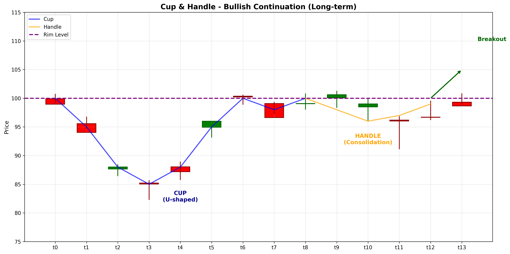

# Cup & Handle

## Kurzbeschreibung

Das Cup & Handle Pattern ist eine bullische Fortsetzungsformation mit einer U-förmigen "Tasse" (Cup) gefolgt von einer kleineren Konsolidierungs-Phase genannt "Henkel" (Handle). Die Formation tritt nach einem Aufwärtstrend auf und signalisiert eine Pause vor der Fortsetzung.

## Art der Formation

**Bullische Fortsetzungsformation**

## Aufbau der Formation

Das Cup & Handle besteht aus zwei deutlichen Teilen:

Die **Tasse (Cup)** ist ein U-förmiges Muster, das sich über mehrere Wochen bis Monate entwickelt. Der Kurs fällt von einem Hochpunkt ab, findet Unterstützung und steigt wieder zu einem ähnlichen Hochpunkt wie dem ursprünglichen.

Die **Henkel (Handle)** bildet sich, nachdem der Kurs das ursprüngliche Hochpunkt der Tasse erreicht hat. Sie ist eine leichte Konsolidierungs-Phase mit einem kleinen Rückgang. Der Henkel wird oft als ein kleiner Flaggen-ähnliches Muster beschrieben.

Die Henkel sollte nicht über 50% der Tassen-Tiefe fallen.

Der Bruch über den Hochpunkt des Henkels aktiviert das Muster.

## Bedeutung

Das Cup & Handle signalisiert, dass Verkäufer eine Möglichkeit zum Verkauf hatten (Tasse), aber der Aufwärtstrend sich fortsetzte (zurück zu Hochpunkten). Der Henkel stellt eine weitere Test des Sentiments dar.

Das Pattern ist sehr zuverlässig, da es zeigt, dass der Markt mehrmals versucht hat, rückgängig zu machen, aber es nicht gelang.

## Trading

**Einstiegspunkt**: Bruch über das Hochpunkt des Henkels.

**Preisziel**: Die Tiefe der Tasse wird vom Ausbruchs-Punkt nach oben gemessen.

**Stop Loss**: Unter der Henkel-Linie oder unter der Tassen-Unterstützung.

### Falscher Alarm

Ein falscher Alarm tritt auf, wenn der Kurs unter die Tassen-Unterstützung fällt.

---

## Zusammenfassung

| Eigenschaft | Beschreibung |
|-------------|--------------|
| **Pattern-Typ** | Bullische Fortsetzungsformation |
| **Komponenten** | U-förmige Tasse + Henkel |
| **Kontext** | Aufwärtstrend |
| **Zeitrahmen** | Mehrere Wochen bis Monate |
| **Signal** | Pause vor Fortsetzung |
| **Einstieg** | Bruch über Henkel-Hochpunkt |
| **Preisziel** | Tassen-Tiefe vom Bruchs-Punkt |
| **Stop Loss** | Unter Tassen-Unterstützung |
| **Zuverlässigkeit** | Sehr hoch |
| **Invalidierung** | Bruch unter Tassen-Support |
| **Stärke** | Sehr stark |
