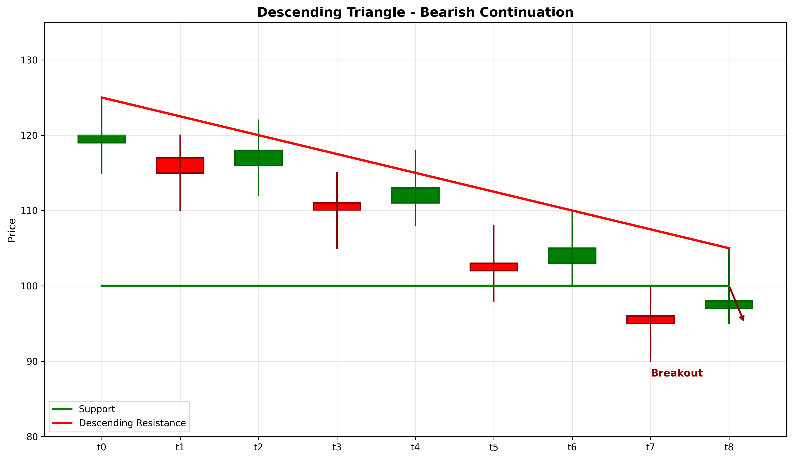

# Descending Triangle

## Kurzbeschreibung

Das Descending Triangle Pattern ist eine bärische Fortsetzungsformation mit einer horizontalen Unterstützungs-Linie (Unterseite) und einer fallenden Trendlinie (Oberseite). Der Kurs bewegt sich in einem dreieckigen Bereich, wobei jeder Anstieg niedriger ist als der vorherige.

## Art der Formation

**Bärische Fortsetzungsformation**

## Aufbau der Formation

Das Descending Triangle entsteht typischerweise in einem Abwärtstrend und signalisiert die Fortsetzung dieses Trends.

Die **horizontale Unterstützungs-Linie** wird durch mehrere Tiefpunkte auf nahezu gleichem Niveau gebildet. Der Markt findet bei diesem Niveau wiederholt Unterstützung.

Die **fallende Trendlinie** wird durch sinkende Hochpunkte gebildet. Jeder Anstieg erreicht ein niedrigeres Maximum als zuvor.

Diese Kombination zeigt, dass Verkäufer stärker werden (niedrigere Hochpunkte), während Käufer schwächer werden (gleiche Tiefpunkte).

Der Bruch unter die Unterstützungs-Linie aktiviert das Muster und signalisiert eine bärische Bewegung.

## Bedeutung

Das Descending Triangle deutet auf ein Ungleichgewicht zwischen Angebot und Nachfrage hin. Verkäufer drücken den Kurs immer tiefer, finden aber bei der Unterstützungs-Linie Widerstand.

Der dreieckige Quetsch zeigt, dass Volatilität abnimmt, während die Spannung aufbaut. Der Bruch kommt typically explosiv nach unten.

## Trading

**Einstiegspunkt**: Bruch unter die Unterstützungs-Linie mit erhöhtem Volumen.

**Preisziel**: Die Tiefe des Dreiecks (Hochster Punkt minus Unterstützungs-Niveau) wird vom Ausbruchs-Punkt nach unten gemessen.

**Stop Loss**: Über der fallenden Trendlinie oder über dem letzten signifikanten Hochpunkt.

### Falscher Alarm

Ein falscher Alarm tritt auf, wenn der Kurs über die Trendlinie steigt, anstatt unter die Unterstützung zu brechen.

---

## Zusammenfassung

| Eigenschaft | Beschreibung |
|-------------|--------------|
| **Pattern-Typ** | Bärische Fortsetzungsformation |
| **Komponenten** | Horizontale Support + Fallende Trendlinie |
| **Kontext** | Abwärtstrend |
| **Signal** | Steigende Verkaufskraft, bevorstehender Ausbruch |
| **Einstieg** | Bruch unter Support |
| **Preisziel** | Dreiecks-Tiefe vom Ausbruchs-Punkt |
| **Stop Loss** | Über der Trendlinie |
| **Zuverlässigkeit** | Hoch |
| **Invalidierung** | Bruch über Trendlinie |
| **Stärke** | Stark |
