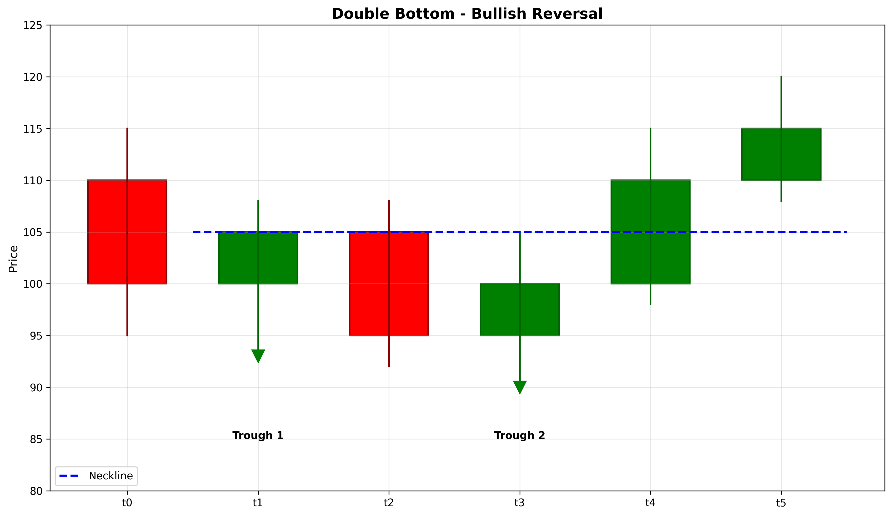

# Double Bottom

## Kurzbeschreibung

Das Double Bottom Pattern ist die bullische Spiegelung des Double Top Musters. Es besteht aus zwei aufeinanderfolgenden Tiefpunkten auf nahezu gleichem Niveau mit einem Anstieg dazwischen. Die Formation sieht aus wie ein großes "W" und signalisiert Unterstützung gegen weitere Rückgänge.

## Art der Formation

**Bullische Umkehrformation**

## Aufbau der Formation

Das Double Bottom Pattern entsteht nach einer Abwärtsbewegung und zeigt eine wachsende Kaufkraft.

Die **erste Talsohle (Valley)** bildet sich am Ende einer Abwärtsbewegung. Der Kurs erreicht einen Tiefpunkt und wird dann von Käufern nach oben gedrückt.

Der **Anstieg (Rebound)** erfolgt nach dem ersten Tiefpunkt. Der Kurs steigt, trifft aber auf Verkaufsdruck an einem bestimmten Niveau.

Die **zweite Talsohle (Valley)** bildet sich, wenn der Kurs erneut fällt und versucht, das erste Tiefpunkt zu untergehen. Allerdings scheitert der Kurs daran, ein neues Tief zu erreichen, und dreht nach oben ab.

Die Trendlinie verbindet die beiden Tiefpunkte (Support) und der Bruch darüber aktiviert das Muster.

## Bedeutung

Das Double Bottom Pattern signalisiert, dass Verkäufer bei zwei Gelegenheiten versucht haben, den Preis zu drücken, aber gescheitert sind. Dies zeigt, dass eine psychologische Unterstützungs-Level existiert.

Der fehlgeschlagene Versuch, ein neues Tief zu etablieren, zeigt Schwäche des Abwärtstrends und deutet darauf hin, dass die Kontrolle vom Verkäufer zum Käufer übergeht.

Das Pattern ist zuverlässiger, wenn die beiden Tiefpunkte auf exakt dem gleichen Niveau liegen und der Anstieg signifikant ist.

## Trading

**Einstiegspunkt**: Der Einstiegspunkt ist der Bruch über die Neckline (das Niveau des Hochpunkts zwischen den beiden Tälern). Dies bestätigt das Muster.

**Preisziel**: Das Preisziel wird berechnet, indem die Tiefe des Musters (von der Neckline bis zu den Tiefpunkten) von der Neckline nach oben gemessen wird.

Beispiel: Neckline bei 500, Tiefpunkte bei 480, Abstand 20. Preisziel: 500 + 20 = 520.

**Stop Loss**: Der Stop Loss wird unter den Tiefpunkten platziert, da ein Bruch unter diesem Niveau das Muster invalidiert.

### Falscher Alarm

Ein falscher Alarm tritt auf, wenn der Kurs die Neckline überschreitet, aber schnell wieder unter sie zurückkehrt. Ein neuer Tiefpunkt unter den ursprünglichen Talern würde das Muster ebenfalls invalidieren.

---

## Zusammenfassung

| Eigenschaft | Beschreibung |
|-------------|--------------|
| **Pattern-Typ** | Bullische Umkehrformation |
| **Komponenten** | 2 Tiefpunkte auf gleichem Niveau |
| **Vorheriger Trend** | Abwärtstrend |
| **Signal** | Unterstützungs-Bestätigung und Umkehr |
| **Einstieg** | Bruch über Neckline |
| **Preisziel** | Muster-Tiefe zu Neckline addiert |
| **Stop Loss** | Unterhalb der Tiefpunkte |
| **Zuverlässigkeit** | Hoch |
| **Invalidierung** | Kurs unter Tiefpunkten |
| **Stärke** | Stark |
