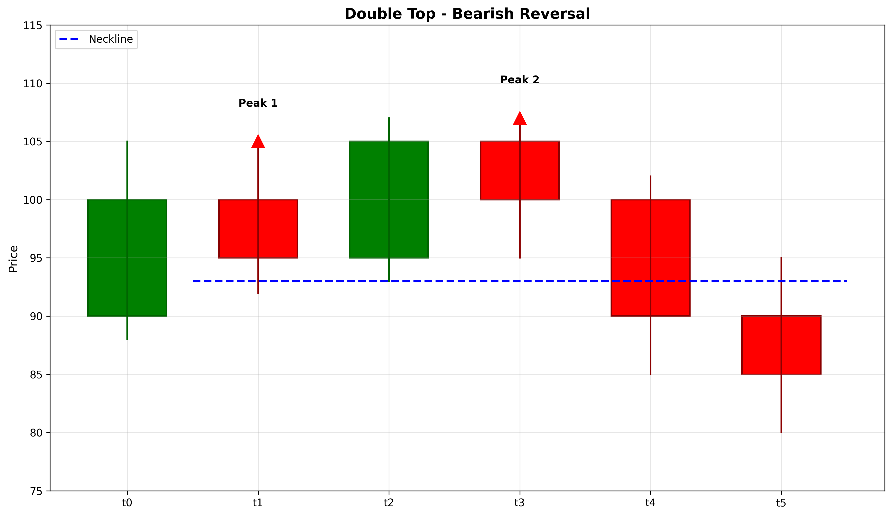

# Double Top

## Kurzbeschreibung

Das Double Top Pattern besteht aus zwei aufeinanderfolgenden Hochpunkten auf nahezu gleichem Niveau mit einem Rückgang dazwischen. Die Formation sieht aus wie ein großes "M" und signalisiert den Widerstand des Marktes gegen weitere Anstiege.

## Art der Formation

**Bearische Umkehrformation**

## Aufbau der Formation

Das Double Top Pattern entsteht nach einer Aufwärtsbewegung und zeigt eine fehlende Kraft der Käufer.

Die **erste Spitze (Peak)** bildet sich am Ende einer Aufwärtsbewegung. Der Kurs erreicht einen Hochpunkt und wird dann von Verkäufern nach unten gedrückt.

Der **Rückgang (Pullback)** erfolgt nach dem ersten Hochpunkt. Der Kurs fällt, findet aber Unterstützung an einem bestimmten Niveau. Dies wird zur Trendlinie oder Neckline des Musters.

Die **zweite Spitze (Peak)** bildet sich, wenn der Kurs erneut ansteigt und versucht, das erste Hochpunkt zu überbieten. Allerdings scheitert der Kurs daran, ein neues Hoch zu erreichen, und dreht nach unten ab.

Die Trendlinie verbindet die beiden Hochpunkte (Resistance) und der Bruch darunter aktiviert das Muster.

## Bedeutung

Das Double Top Pattern signalisiert, dass Käufer bei zwei Gelegenheiten versucht haben, den Preis zu treiben, aber gescheitert sind. Dies zeigt, dass eine psychologische Widerstands-Level existiert.

Der fehlgeschlagene Versuch, ein neues Hoch zu etablieren, zeigt Schwäche des Aufwärtstrends und deutet darauf hin, dass die Kontrolle vom Käufer zum Verkäufer übergeht.

Das Pattern ist zuverlässiger, wenn die beiden Hochpunkte auf exakt dem gleichen Niveau liegen und der Rückgang signifikant ist.

## Trading

**Einstiegspunkt**: Der Einstiegspunkt ist der Bruch unter die Neckline (das Niveau des Tiefpunkts zwischen den beiden Spitzen). Dies bestätigt das Muster.

**Preisziel**: Das Preisziel wird berechnet, indem die Höhe des Musters (von der Neckline bis zu den Hochpunkten) von der Neckline nach unten gemessen wird.

Beispiel: Neckline bei 500, Hochpunkte bei 520, Abstand 20. Preisziel: 500 - 20 = 480.

**Stop Loss**: Der Stop Loss wird über den Hochpunkten platziert, da ein Bruch über diesem Niveau das Muster invalidiert.

### Falscher Alarm

Ein falscher Alarm tritt auf, wenn der Kurs die Neckline unterschreitet, aber schnell wieder über sie zurückkehrt. Ein neuer Hochpunkt über den ursprünglichen Gipfeln würde das Muster ebenfalls invalidieren.

---

## Zusammenfassung

| Eigenschaft | Beschreibung |
|-------------|--------------|
| **Pattern-Typ** | Bearische Umkehrformation |
| **Komponenten** | 2 Hochpunkte auf gleichem Niveau |
| **Vorheriger Trend** | Aufwärtstrend |
| **Signal** | Widerstands-Bestätigung und Umkehr |
| **Einstieg** | Bruch unter Neckline |
| **Preisziel** | Muster-Höhe von Neckline subtrahiert |
| **Stop Loss** | Oberhalb der Hochpunkte |
| **Zuverlässigkeit** | Hoch |
| **Invalidierung** | Kurs über Hochpunkten |
| **Stärke** | Stark |
