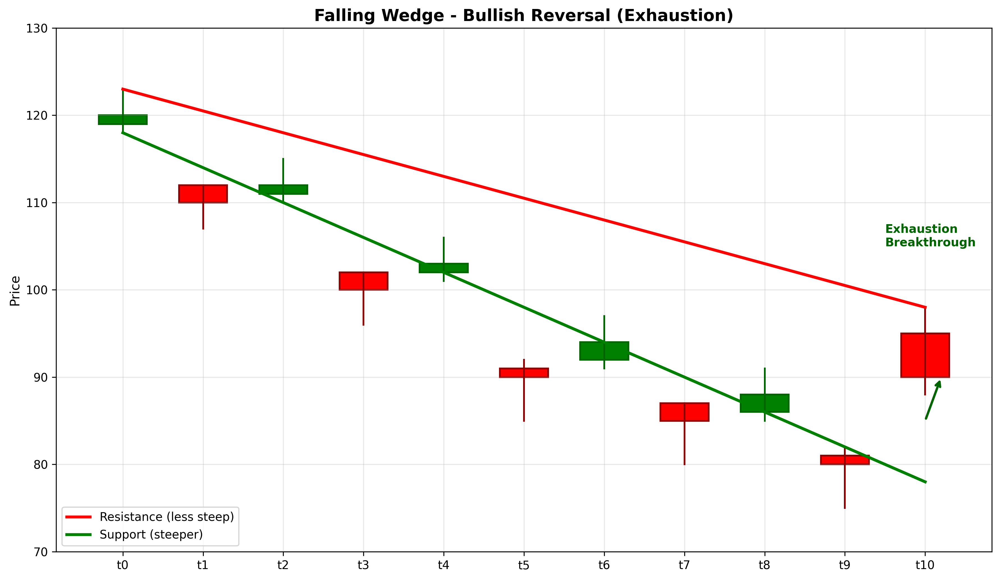

# Falling Wedge

## Kurzbeschreibung

Das Falling Wedge Pattern ist eine bullische Umkehrformation mit zwei fallenden Trendlinien, die konvergieren. Im Gegensatz zum Descending Triangle sind bei diesem Pattern beide Linien fallend, wodurch ein Keil entsteht. Die Formation tritt nach einem Abwärtstrend auf.

## Art der Formation

**Bullische Umkehrformation**

## Aufbau der Formation

Das Falling Wedge zeigt einen Rückgang, aber mit abnehmender Dynamik.

Beide die **Unterstützungs-Linie** und die **Widerstands-Linie** fallen ab, aber die Widerstands-Linie hat einen flacheren Winkel als die Unterstützungs-Linie.

Dies führt dazu, dass der Kurs in einem sich verengenden Keil absteigt. Die Tiefpunkte werden progressiv höher relativ zur Widerstands-Linie.

Der Kurs kann nicht unter die Unterstützungs-Linie fallen, und der Keil verengt sich immer mehr.

## Bedeutung

Das Falling Wedge signalisiert ein Erschöpfungs-Pattern. Obwohl der Kurs absteigt, nimmt die negative Dynamik ab. Verkäufer verlieren an Kraft.

Der Bruch erfolgt typischerweise nach oben (über die Widerstands-Linie), was eine bullische Umkehr signalisiert.

Dieses Pattern gilt als zuverlässig zur Vorhersage von Trendumkehrungen.

## Trading

**Einstiegspunkt**: Bruch über die Widerstands-Linie.

**Preisziel**: Die Breite des Keils (Differenz zwischen Widerstands- und Unterstützungs-Linie beim Beginn) wird vom Bruchs-Punkt nach oben gemessen.

**Stop Loss**: Unter der Unterstützungs-Linie.

### Falscher Alarm

Ein falscher Alarm tritt auf, wenn der Kurs unter die Unterstützungs-Linie bricht, anstatt nach oben auszubrechen.

---

## Zusammenfassung

| Eigenschaft | Beschreibung |
|-------------|--------------|
| **Pattern-Typ** | Bullische Umkehrformation |
| **Komponenten** | 2 fallende konvergierende Linien |
| **Kontext** | Abwärtstrend mit abnehmender Dynamik |
| **Signal** | Erschöpfung und bevorstehende Umkehr |
| **Einstieg** | Bruch über Widerstands-Linie |
| **Preisziel** | Keil-Breite vom Bruchs-Punkt |
| **Stop Loss** | Unter Unterstützungs-Linie |
| **Zuverlässigkeit** | Hoch |
| **Invalidierung** | Bruch unter Unterstützungs-Linie |
| **Stärke** | Stark |
