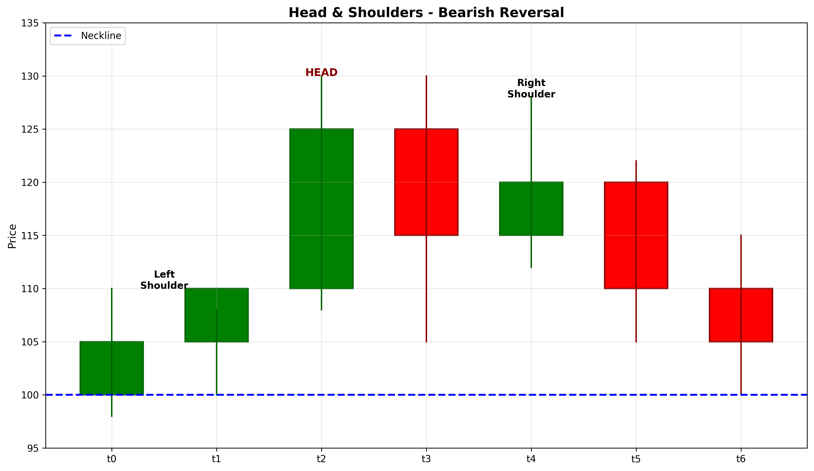

# Head & Shoulders

## Kurzbeschreibung

Das Head & Shoulders Pattern besteht aus drei aufeinanderfolgenden Gipfeln, wobei der mittlere Gipfel (Kopf) höher ist als die beiden äußeren Gipfel (Schultern). Die Formation wird durch eine Trendlinie verbunden, die die Tiefpunkte zwischen den Gipfeln markiert.

## Art der Formation

**Bearische Umkehrformation**

## Aufbau der Formation

Das Head & Shoulders Pattern entsteht nach einer ausgeprägten Aufwärtsbewegung und signalisiert das Ende des Aufwärtstrends.

Die Formation besteht aus drei Komponenten:

Die **erste Schulter (Shoulder)** entsteht, wenn der Kurs nach einem starken Anstieg ein lokales Maximum bildet und anschließend leicht zurückfällt.

Der **Kopf (Head)** bildet sich, wenn der Kurs erneut ansteigt und dabei das Maximum der ersten Schulter überwindet. Danach erfolgt ein Rückgang auf das Niveau des Rückenrückgangs.

Die **zweite Schulter (Shoulder)** entsteht, wenn der Kurs ein drittes Mal ansteigt, diesmal aber das Maximum des Kopfes nicht erreicht. Stattdessen bildet sich ein lokales Hoch, das in etwa auf dem Niveau der ersten Schulter liegt.

Die **Neckline (Halslinie)** verbindet die beiden Tiefpunkte zwischen den Schultern und dem Kopf. Sie dient als kritische Unterstützungslinie und als Aktivierungspunkt für das Muster.

## Bedeutung

Das Head & Shoulders Pattern ist eines der zuverlässigsten Umkehrmuster im technischen Analyse und signalisiert einen starken Übergang von Kaufdruck zu Verkaufsdruck.

Die sinkenden Hochpunkte (Schulter niedriger als Kopf) deuten auf ein Abschwächen des Aufwärtstrends hin. Der Verkauf bei der zweiten Schulter zeigt, dass Käufer Schwierigkeiten haben, die Preise zu halten.

Wenn der Kurs unter die Neckline fällt, wird dies als Bestätigung des Musters interpretiert und signalisiert einen signifikanten bevorstehenden Preisrückgang.

## Trading

Das Head & Shoulders Pattern bietet mehrere Handelsmöglichkeiten:

**Einstiegspunkt**: Der optimale Einstiegspunkt ist, wenn der Kurs die Neckline unterschreitet. Dies bestätigt das Muster und aktiviert die bärische Bewegung.

Einige Trader warten auf ein Retest der Neckline nach dem Bruch, um mit verbessertem Risiko/Gewinn-Verhältnis einzusteigen.

**Preisziel**: Das Mindestpreisziel wird berechnet, indem die Höhe des Kopfes (von der Neckline bis zum höchsten Punkt des Kopfes) gemessen wird. Diese Distanz wird nach unten von der Neckline abgezogen.

Beispiel: Wenn der Kopf 100 Euro über der Neckline liegt und die Neckline bei 500 Euro ist, beträgt das Preisziel mindestens 400 Euro.

**Stop Loss**: Der Stop Loss wird typischerweise über dem höchsten Punkt des Kopfes platziert, da ein Bruch oberhalb dieser Marke das Muster invalidiert.

### Falscher Alarm

Ein falscher Alarm tritt auf, wenn der Kurs die Neckline unterschreitet, aber schnell wieder über sie zurückkehrt und einen neuen Aufwärtstrend beginnt. In diesem Fall sollte die Position sofort glattgestellt werden.

---

## Zusammenfassung

| Eigenschaft | Beschreibung |
|-------------|--------------|
| **Pattern-Typ** | Bearische Umkehrformation |
| **Komponenten** | 3 Gipfel (Schulter-Kopf-Schulter) + Neckline |
| **Vorheriger Trend** | Starke Aufwärtsbewegung |
| **Signal** | Trendumkehr nach unten |
| **Einstieg** | Bruch unter Neckline |
| **Preisziel** | Kopfhöhe von Neckline subtrahiert |
| **Stop Loss** | Oberhalb Kopfmaximum |
| **Zuverlässigkeit** | Sehr hoch |
| **Invalidierung** | Kurs über Kopfmaximum |
| **Stärke** | Sehr stark (eines der zuverlässigsten) |
