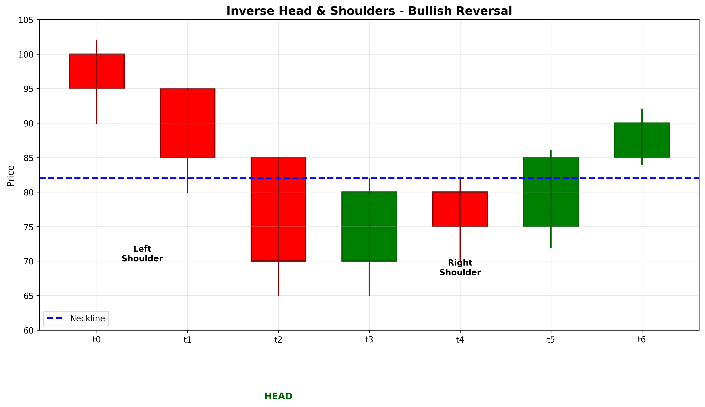

# Inverse Head & Shoulders

## Kurzbeschreibung

Das Inverse Head & Shoulders Pattern ist die Spiegelung des klassischen Head & Shoulders Musters. Es besteht aus drei aufeinanderfolgenden Tiefpunkten, wobei der mittlere Tiefpunkt (Kopf) tiefer ist als die beiden äußeren Tiefpunkte (Schultern). Die Formation wird durch eine Trendlinie verbunden, die die Hochpunkte zwischen den Tiefpunkten markiert.

## Art der Formation

**Bullische Umkehrformation**

## Aufbau der Formation

Das Inverse Head & Shoulders Pattern entsteht nach einer ausgeprägten Abwärtsbewegung und signalisiert das Ende des Abwärtstrends.

Die Formation besteht aus drei Komponenten:

Die **erste Schulter (Shoulder)** entsteht, wenn der Kurs nach einem starken Rückgang ein lokales Minimum bildet und anschließend leicht ansteigt.

Der **Kopf (Head)** bildet sich, wenn der Kurs erneut fällt und dabei das Minimum der ersten Schulter unterschreitet. Danach erfolgt ein Anstieg auf das Niveau des Aufstiegs zwischen Schulter und Kopf.

Die **zweite Schulter (Shoulder)** entsteht, wenn der Kurs ein drittes Mal fällt, diesmal aber das Minimum des Kopfes nicht erreicht. Stattdessen bildet sich ein lokales Tief, das in etwa auf dem Niveau der ersten Schulter liegt.

Die **Neckline (Halslinie)** verbindet die beiden Hochpunkte zwischen den Schultern und dem Kopf. Sie dient als kritische Widerstandslinie und als Aktivierungspunkt für das Muster.

## Bedeutung

Das Inverse Head & Shoulders Pattern ist das bullische Gegenstück zu Head & Shoulders und signalisiert einen starken Übergang von Verkaufsdruck zu Kaufdruck.

Die steigenden Tiefpunkte (Schulter höher als Kopf) deuten auf eine Abschwächung des Abwärtstrends hin. Der Kauf bei der zweiten Schulter zeigt, dass Verkäufer Schwierigkeiten haben, die Preise weiter zu drücken.

Wenn der Kurs über die Neckline steigt, wird dies als Bestätigung des Musters interpretiert und signalisiert einen signifikanten bevorstehenden Preisanstieg.

## Trading

Das Inverse Head & Shoulders Pattern bietet mehrere Handelsmöglichkeiten:

**Einstiegspunkt**: Der optimale Einstiegspunkt ist, wenn der Kurs die Neckline überschreitet. Dies bestätigt das Muster und aktiviert die bullische Bewegung.

Einige Trader warten auf ein Retest der Neckline nach dem Bruch, um mit verbessertem Risiko/Gewinn-Verhältnis einzusteigen.

**Preisziel**: Das Mindestpreisziel wird berechnet, indem die Tiefe des Kopfes (von der Neckline bis zum tiefsten Punkt des Kopfes) gemessen wird. Diese Distanz wird nach oben von der Neckline addiert.

Beispiel: Wenn der Kopf 100 Euro unter der Neckline liegt und die Neckline bei 500 Euro ist, beträgt das Preisziel mindestens 600 Euro.

**Stop Loss**: Der Stop Loss wird typischerweise unter dem tiefsten Punkt des Kopfes platziert, da ein Bruch unterhalb dieser Marke das Muster invalidiert.

### Falscher Alarm

Ein falscher Alarm tritt auf, wenn der Kurs die Neckline überschreitet, aber schnell wieder unter sie zurückkehrt und einen neuen Abwärtstrend beginnt. In diesem Fall sollte die Position sofort glattgestellt werden.

---

## Zusammenfassung

| Eigenschaft | Beschreibung |
|-------------|--------------|
| **Pattern-Typ** | Bullische Umkehrformation |
| **Komponenten** | 3 Tiefpunkte (Schulter-Kopf-Schulter) + Neckline |
| **Vorheriger Trend** | Starke Abwärtsbewegung |
| **Signal** | Trendumkehr nach oben |
| **Einstieg** | Bruch über Neckline |
| **Preisziel** | Kopftiefe von Neckline addiert |
| **Stop Loss** | Unterhalb Kopfminimum |
| **Zuverlässigkeit** | Sehr hoch |
| **Invalidierung** | Kurs unter Kopfminimum |
| **Stärke** | Sehr stark (eines der zuverlässigsten) |
