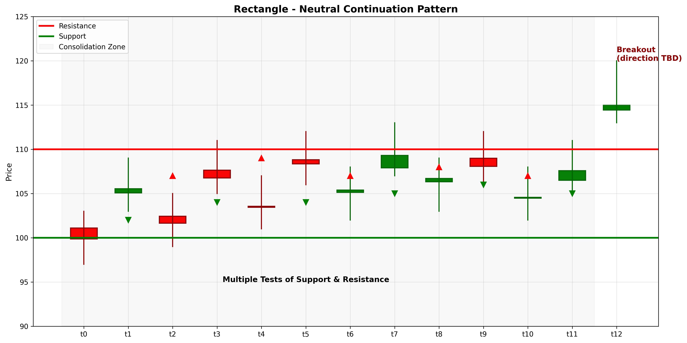

# Rectangle

## Kurzbeschreibung

Das Rectangle Pattern ist eine neutrale Fortsetzungsformation mit einer horizontalen Widerstands-Linie oben und einer horizontalen Unterstützungs-Linie unten. Der Kurs bewegt sich in einem rechteckigen Bereich hin und her. Der Ausbruch kann in jede Richtung erfolgen.

## Art der Formation

**Neutrale Fortsetzungsformation**

## Aufbau der Formation

Das Rectangle bildet sich in den meisten Trends und zeigt eine Phase von Konsolidierung.

Die **Widerstands-Linie** ist eine horizontale Linie, an der der Kurs mehrfach nach unten abgewiesen wird.

Die **Unterstützungs-Linie** ist eine horizontale Linie, an der der Kurs mehrfach Unterstützung findet.

Der Kurs oszilliert zwischen diesen beiden Linien mehrfach hin und her. Der Kurs kann die Grenzen nicht durchbrechen, was einen Kampf zwischen Käufern und Verkäufern anzeigt.

Die Anzahl der Tests (Bounces) an Widerstands- und Unterstützungs-Linien variiert, aber mindestens 2-3 Tests an jeder Seite machen das Pattern zuverlässiger.

## Bedeutung

Das Rectangle signalisiert eine Pause im Trend. Käufer und Verkäufer sind kurzzeitig im Gleichgewicht.

Das Pattern ist ein Volatilitäts-Quetsch. Der Kurs wird immer enger und ein Ausbruch steht bevor. Die Richtung wird durch den Trend vor dem Rectangle angedeutet.

Ein Ausbruch mit hohem Volumen signalisiert die Richtung der nächsten Bewegung.

## Trading

**Einstiegspunkt**: Bruch über die Widerstands-Linie (für Long) oder unter die Unterstützungs-Linie (für Short).

**Preisziel**: Die Höhe des Rectangles wird vom Bruchs-Punkt gemessen.

**Stop Loss**: Auf der anderen Seite des Rectangles von der Bruch-Stelle.

### Falscher Alarm

Ein falscher Alarm tritt auf, wenn der Kurs minimal aus dem Rectangle bricht, dann aber schnell zurückkehrt. Volumen ist wichtig für Bestätigung.

---

## Zusammenfassung

| Eigenschaft | Beschreibung |
|-------------|--------------|
| **Pattern-Typ** | Neutrale Fortsetzungsformation |
| **Komponenten** | Horizontale Support + Resistance |
| **Kontext** | Jeder Trend möglich |
| **Signal** | Konsolidierung und bevorstehender Ausbruch |
| **Einstieg** | Bruch mit Volumen |
| **Preisziel** | Rechtecks-Höhe vom Bruchs-Punkt |
| **Stop Loss** | Auf der anderen Seite des Rectangles |
| **Zuverlässigkeit** | Mittel bis Hoch |
| **Invalidierung** | Rückkehr in Rectangle |
| **Stärke** | Mittel bis Stark |
