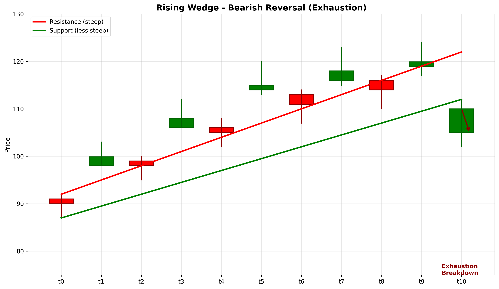

# Rising Wedge

## Kurzbeschreibung

Das Rising Wedge Pattern ist eine bärische Umkehrformation mit zwei aufsteigenden Trendlinien, die konvergieren. Im Gegensatz zum Ascending Triangle sind bei diesem Pattern beide Linien ansteigend, wodurch ein Keil entsteht. Die Formation tritt nach einem Aufwärtstrend auf.

## Art der Formation

**Bärische Umkehrformation**

## Aufbau der Formation

Das Rising Wedge zeigt einen Aufstieg, aber mit abnehmender Dynamik.

Beide die **Widerstands-Linie** und die **Unterstützungs-Linie** steigen an, aber die Unterstützungs-Linie hat einen steileren Winkel als die Widerstands-Linie.

Dies führt dazu, dass der Kurs in einem sich verengenden Keil ansteigt. Die Höchstpunkte werden progressiv niedriger relativ zur Unterstützungs-Linie.

Der Kurs kann die Widerstands-Linie nicht durchbrechen, und der Keil verengt sich immer mehr.

## Bedeutung

Das Rising Wedge signalisiert ein Erschöpfungs-Pattern. Obwohl der Kurs ansteigt, nimmt die Momentum ab. Käufer verlieren an Kraft.

Der Bruch erfolgt typischerweise nach unten (unter die Unterstützungs-Linie), was eine bärische Umkehr signalisiert.

Dieses Pattern gilt als zuverlässig zur Vorhersage von Trendumkehrungen.

## Trading

**Einstiegspunkt**: Bruch unter die Unterstützungs-Linie.

**Preisziel**: Die Breite des Keils (Differenz zwischen Widerstands- und Unterstützungs-Linie beim Beginn) wird vom Bruchs-Punkt nach unten gemessen.

**Stop Loss**: Über der Widerstands-Linie.

### Falscher Alarm

Ein falscher Alarm tritt auf, wenn der Kurs über die Widerstands-Linie bricht, anstatt nach unten auszubrechen.

---

## Zusammenfassung

| Eigenschaft | Beschreibung |
|-------------|--------------|
| **Pattern-Typ** | Bärische Umkehrformation |
| **Komponenten** | 2 steigende konvergierende Linien |
| **Kontext** | Aufwärtstrend mit abnehmender Dynamik |
| **Signal** | Erschöpfung und bevorstehende Umkehr |
| **Einstieg** | Bruch unter Unterstützungs-Linie |
| **Preisziel** | Keil-Breite vom Bruchs-Punkt |
| **Stop Loss** | Über Widerstands-Linie |
| **Zuverlässigkeit** | Hoch |
| **Invalidierung** | Bruch über Widerstands-Linie |
| **Stärke** | Stark |
