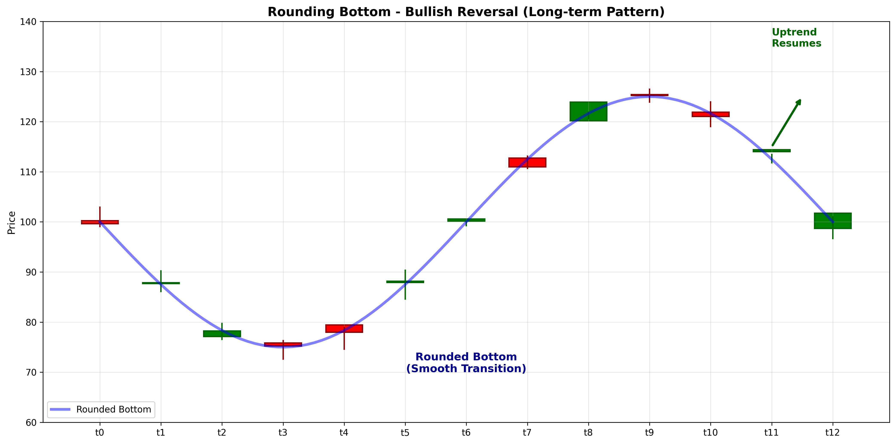

# Rounding Bottom

## Kurzbeschreibung

Das Rounding Bottom Pattern ist eine bullische Umkehrformation mit einer sanften, abgerundeten U-förmigen Kurve am Boden eines Abwärtstrends. Im Gegensatz zu Umkehrmustern wie Double Bottom hat das Rounding Bottom keine scharfen Tiefpunkte, sondern einen glatten, kontinuierlichen Übergang.

## Art der Formation

**Bullische Umkehrformation**

## Aufbau der Formation

Das Rounding Bottom entwickelt sich graduell über einen längeren Zeitraum, typischerweise Wochen oder Monate.

Die **Abwärtsbewegung** wird schrittweise langsamer. Die Rückgänge werden immer kleiner und die Erholungen immer größer.

Der **Boden (Bottom)** ist ein sanfter, abgerundeter Punkt ohne scharfe Spitze. Der Übergang von Rückgang zu Anstieg ist graduel.

Die **Aufwärtsbewegung** beschleunigt sich dann, wenn der Kurs den Boden verlässt und in einen neuen Aufwärtstrend übergeht.

Volumen steigt typischerweise während der Aufwärtsbewegung.

## Bedeutung

Das Rounding Bottom signalisiert einen psychologischen Wendepunkt. Der Markt zeigt, dass der Verkaufsdruck nachlässt und der Kaufdruck aufbaut.

Die sanfte Rundung zeigt, dass der Trend-Wechsel organisch und nachhaltig ist, nicht volatil oder aggressiv.

Dieses Pattern gilt als sehr zuverlässig für längerfristige Umkehrungen.

## Trading

**Einstiegspunkt**: Bruch über die Widerstands-Linie bei oder oberhalb des ursprünglichen Abgangs-Punktes.

**Preisziel**: Die Tiefe vom Boden wird vom Bruchs-Punkt nach oben gemessen. Alternativ kann eine Zielmarke bei frühere Hochpunkte gesetzt werden.

**Stop Loss**: Unter dem Boden des Musters.

### Falscher Alarm

Ein falscher Alarm ist selten, da das Muster sich über lange Zeit entwickelt. Ein Rückgang unter den Boden würde das Muster invalidieren.

---

## Zusammenfassung

| Eigenschaft | Beschreibung |
|-------------|--------------|
| **Pattern-Typ** | Bullische Umkehrformation |
| **Komponenten** | Sanfte U-förmige Kurve |
| **Kontext** | Abwärtstrend |
| **Zeitrahmen** | Mehrere Wochen bis Monate |
| **Signal** | Gradueller Trend-Wechsel |
| **Einstieg** | Bruch über Widerstands-Linie |
| **Preisziel** | Muster-Tiefe vom Bruchs-Punkt |
| **Stop Loss** | Unter dem Boden |
| **Zuverlässigkeit** | Sehr hoch |
| **Invalidierung** | Bruch unter Muster-Boden |
| **Stärke** | Stark (Mittelfristig) |
