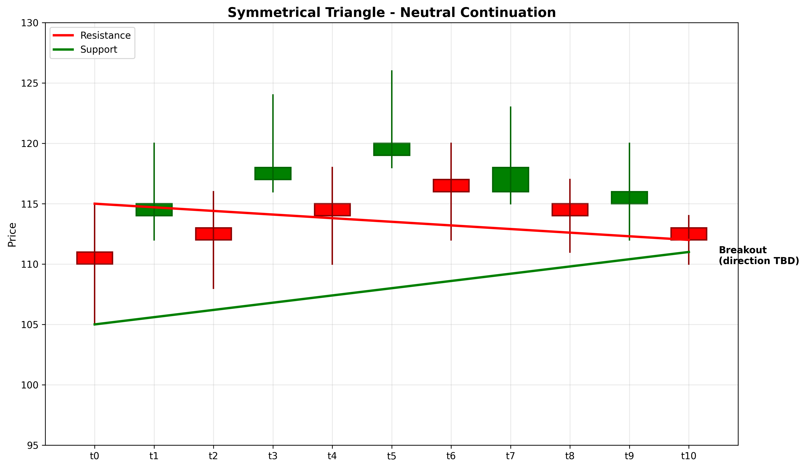

# Symmetrical Triangle

## Kurzbeschreibung

Das Symmetrical Triangle Pattern ist eine neutrale Fortsetzungsformation mit einer fallenden Widerstands-Linie und einer steigenden Unterstützungs-Linie. Die beiden Linien konvergieren auf einen Punkt zu, wodurch ein symmetrisches Dreieck entsteht. Das Pattern ist unabhängig von der Trendrichtung.

## Art der Formation

**Neutrale Fortsetzungsformation** (Kann bullisch oder bärisch sein)

## Aufbau der Formation

Das Symmetrical Triangle zeigt eine Phase von Konsolidierung und fallender Volatilität.

Die **fallende Widerstands-Linie** wird durch sinkende Hochpunkte gebildet. Jedes Hochpunkt ist niedriger als das vorherige.

Die **steigende Unterstützungs-Linie** wird durch steigende Tiefpunkte gebildet. Jedes Tiefpunkt ist höher als das vorherige.

Die beiden Linien konvergieren auf einen gemeinsamen Punkt zu. Dies wird als "Squeeze" bezeichnet - der Markt wird immer enger.

Der Bruch aus dem Dreieck (in jede Richtung) signalisiert eine Breakout-Bewegung.

## Bedeutung

Das Symmetrical Triangle signalisiert einen Kampf zwischen Käufern und Verkäufern. Keiner hat die Oberhand, daher bewegt sich der Markt in ein immer engeres Muster.

Der Ausbruch kann in jede Richtung erfolgen. Dies ist kein Richtungs-Signal, sondern ein Volatilitäts-Signal. Große Bewegung steht bevor - die Richtung wird durch den Bruch bestimmt.

## Trading

**Einstiegspunkt**: Bruch aus dem Dreieck (oben oder unten) mit erhöhtem Volumen.

**Preisziel**: Die Höhe des Dreiecks (vom Einstiegspunkt des Kurs bis zur Spitze) wird vom Bruchs-Punkt gemessen.

**Stop Loss**: Auf der anderen Seite des Dreiecks von der Bruch-Stelle.

### Falscher Alarm

Ein falscher Alarm tritt auf, wenn der Kurs minimal aus dem Dreieck bricht, dann aber schnell zurückkehrt. Volumen-Bestätigung ist wichtig.

---

## Zusammenfassung

| Eigenschaft | Beschreibung |
|-------------|--------------|
| **Pattern-Typ** | Neutrale Fortsetzungsformation |
| **Komponenten** | Fallende Resistance + Steigende Support |
| **Kontext** | Jeder Trend möglich |
| **Signal** | Konsolidierung und bevorstehender Ausbruch |
| **Einstieg** | Bruch mit Volumen (jede Richtung) |
| **Preisziel** | Dreiecks-Höhe vom Bruchs-Punkt |
| **Stop Loss** | Auf der anderen Seite des Musters |
| **Zuverlässigkeit** | Mittel (Richtung unbekannt) |
| **Invalidierung** | Wiederkehr in das Dreieck |
| **Stärke** | Mittel bis Stark |
