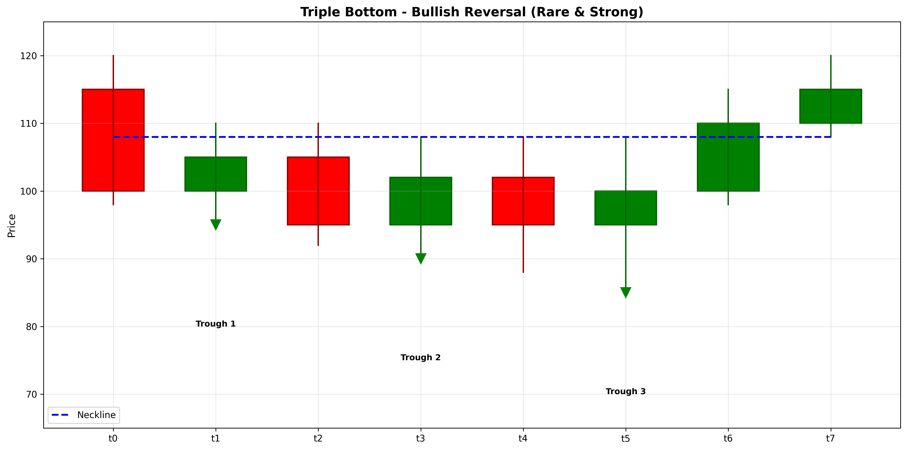

# Triple Bottom

## Kurzbeschreibung

Das Triple Bottom Pattern ist die bullische Spiegelung des Triple Top Musters. Es besteht aus drei aufeinanderfolgenden Tiefpunkten auf nahezu gleichem Niveau mit Anstiegen dazwischen. Es ist eine seltenere und potentiell stärkere Variante des Double Bottom Musters.

## Art der Formation

**Bullische Umkehrformation**

## Aufbau der Formation

Das Triple Bottom Pattern entsteht nach einer längeren Abwärtsbewegung.

Es bilden sich **drei Tiefpunkte** auf nahezu gleichem Niveau. Zwischen jedem Tiefpunkt erfolgt ein signifikanter Anstieg, aber der Kurs findet immer wieder Verkaufsdruck auf ähnlichem Niveau.

Der dreifache Test eines Unterstützungs-Niveaus zeigt, dass der Markt diese Stufe mehrfach stützt. Dies deutet auf sehr starke Unterstützung hin.

Die Trendlinie verbindet die Tiefpunkte und die Neckline verbindet die Hochpunkte dazwischen.

## Bedeutung

Das Triple Bottom signalisiert drei erfolgreiche Verteidigungen eines Unterstützungs-Niveaus. Dies ist psychologisch sehr signifikant und deutet auf eine Trendumkehr hin.

Die Dreiheit der Tests macht dieses Pattern zuverlässiger als Double Bottom. Ein erfolgreicher Bruch über die Neckline signalisiert eine schwerwiegende Trendumkehr.

## Trading

**Einstiegspunkt**: Bruch über die Neckline nach dem dritten Tiefpunkt.

**Preisziel**: Die Tiefe des Musters wird zu Neckline addiert.

**Stop Loss**: Unter den Tiefpunkten.

### Falscher Alarm

Ein falscher Alarm tritt auf, wenn der Kurs einen neuen Tiefpunkt unter den drei ursprünglichen Talern erreicht.

---

## Zusammenfassung

| Eigenschaft | Beschreibung |
|-------------|--------------|
| **Pattern-Typ** | Bullische Umkehrformation |
| **Komponenten** | 3 Tiefpunkte auf gleichem Niveau |
| **Vorheriger Trend** | Starker Abwärtstrend |
| **Signal** | Dreifacher Unterstützungs-Test |
| **Einstieg** | Bruch über Neckline |
| **Preisziel** | Muster-Tiefe zu Neckline addiert |
| **Stop Loss** | Unterhalb der Tiefpunkte |
| **Zuverlässigkeit** | Sehr hoch (selten) |
| **Invalidierung** | Kurs unter Tiefpunkten |
| **Stärke** | Sehr stark |
