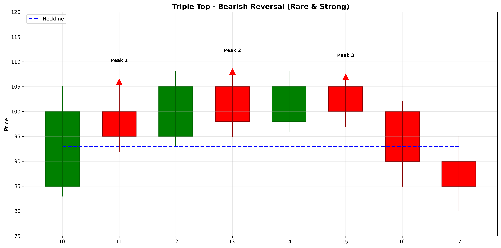

# Triple Top

## Kurzbeschreibung

Das Triple Top Pattern besteht aus drei aufeinanderfolgenden Hochpunkten auf nahezu gleichem Niveau mit Rückgängen dazwischen. Es ist eine seltenere und potentiell stärkere Variante des Double Top Musters und signalisiert größeren Widerstand.

## Art der Formation

**Bearische Umkehrformation**

## Aufbau der Formation

Das Triple Top Pattern entsteht nach einer längeren Aufwärtsbewegung.

Es bilden sich **drei Hochpunkte** auf nahezu gleichem Niveau. Zwischen jedem Hochpunkt erfolgt ein signifikanter Rückgang, aber der Kurs findet immer wieder Unterstützung auf ähnlichem Niveau.

Der dreifache Test eines Widerstands-Niveaus zeigt, dass der Markt diese Stufe mehrfach ablehnt. Dies deutet auf sehr starken Widerstand hin.

Die Trendlinie verbindet die Hochpunkte und die Neckline verbindet die Tiefpunkte dazwischen.

## Bedeutung

Das Triple Top signalisiert drei fehlgeschlagene Versuche, über ein Widerstands-Niveau zu gehen. Dies ist psychologisch sehr signifikant und deutet auf eine Trendumkehr hin.

Die Dreiheit der Tests macht dieses Pattern zuverlässiger als Double Top. Ein erfolgreicher Bruch unter die Neckline signalisiert eine schwerwiegende Trendumkehr.

## Trading

**Einstiegspunkt**: Bruch unter die Neckline nach dem dritten Hochpunkt.

**Preisziel**: Die Höhe des Musters wird von der Neckline subtrahiert.

**Stop Loss**: Über den Hochpunkten.

### Falscher Alarm

Ein falscher Alarm tritt auf, wenn der Kurs einen neuen Hochpunkt über den drei ursprünglichen Gipfeln erreicht.

---

## Zusammenfassung

| Eigenschaft | Beschreibung |
|-------------|--------------|
| **Pattern-Typ** | Bearische Umkehrformation |
| **Komponenten** | 3 Hochpunkte auf gleichem Niveau |
| **Vorheriger Trend** | Starker Aufwärtstrend |
| **Signal** | Dreifacher Widerstands-Test |
| **Einstieg** | Bruch unter Neckline |
| **Preisziel** | Muster-Höhe von Neckline subtrahiert |
| **Stop Loss** | Oberhalb der Hochpunkte |
| **Zuverlässigkeit** | Sehr hoch (selten) |
| **Invalidierung** | Kurs über Hochpunkten |
| **Stärke** | Sehr stark |
